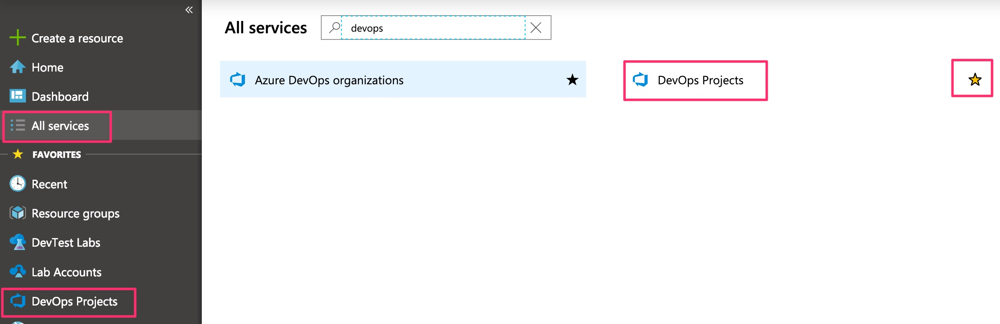

# Lab 1: Create the basic pipeline

This lab will create a working release pipeline using Azure DevOps that will form the basis of the later labs.

# Step 1: Create an Azure DevOps Project

This step will use the Azure Portal DevOps Projects to create the complete initial pipeline.

- In a browser navigate to the [Azure Portal](https://portal.azure.com) (https://portal.azure.com).
- Login with the identity associated with the Azure subscription you want to use.
- Navigate to the DevOps Projects service. Select All services, then type DevOps and then click DevOps Projects. Note that if you select the favourite star then this service will appear in the favourites list on the left hand side to avoid searching for it in future:

[<- Introduction](https://github.com/gidavies/AzureDevOpsLab/blob/master/README.md) | [Lab 2: Agile planning using Azure Boards ->](https://github.com/gidavies/AzureDevOpsLab/blob/master/AzureDevOpsLab2.md)
