# Lab 1: Create the basic pipeline

This lab will create a working release pipeline using Azure DevOps that will form the basis of the later labs.

# Step 1: Create an Azure DevOps Project

This step will use the Azure Portal DevOps Projects to create the complete initial pipeline.

In a browser navigate to the [Azure Portal](https://portal.azure.com) (https://portal.azure.com).

Login with the identity associated with the Azure subscription you want to use.

Navigate to the DevOps Projects service. Select All services, then type DevOps and then click DevOps Projects. Note that if you select the favourite star then this service will appear in the favourites list on the left hand side to avoid searching for it in future:

Click + Add:

Select the programming language for the application. Note that there are a wide range of options but for the purposes of this lab select .NET and then click Next:

Now choose the framework for the selected language. In this case select ASP.NET Core (as it's cross platform) and then Next:

Select the target Azure service. There are many options but for this lab select the Windows Web App (chosen as there is a free tier so this lab can be completed without incurring any costs on your subscription). Click Next:

Provide a project name. This will also be the default Web app name, but note that the Web app name needs to be unique so you may need to try different Web app names until a green tick is shown. Set the Azure region that you wish to run the service in, and also select the Azure DevOps organisation that you wish to use:

Select additional settings:

Note that if you don't have, or want to create a different, Azure DevOps Organisation you can choose to create one here. You may want to set the Pricing tier to the F1 Free and also change where the Application Insights telemetry will be located. Click OK when done:

If all the settings are correct then click Done:

Wait a short while (30 secs) and you should see that the deployment is underway:

Wait a little longer (a couple of minutes, click refresh if impatient) and you should see that the deployment is complete. Click Go to resource:

# Step 2: Explore the created resources

In this step you will take a look at what's been created in Azure.

You should see something like this:

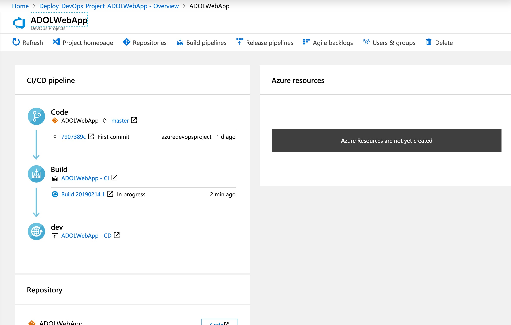

Looking at the CI/CD section the Code section is telling us that the source code for an example app was added to the Git repo in our project:

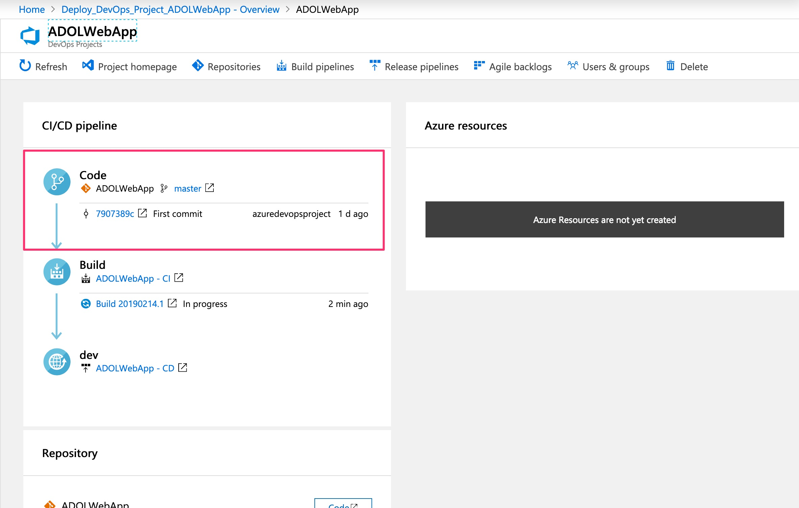

The build section shows that a continuous integration (CI) build definition has been created and is running (or has run, depending on timing):

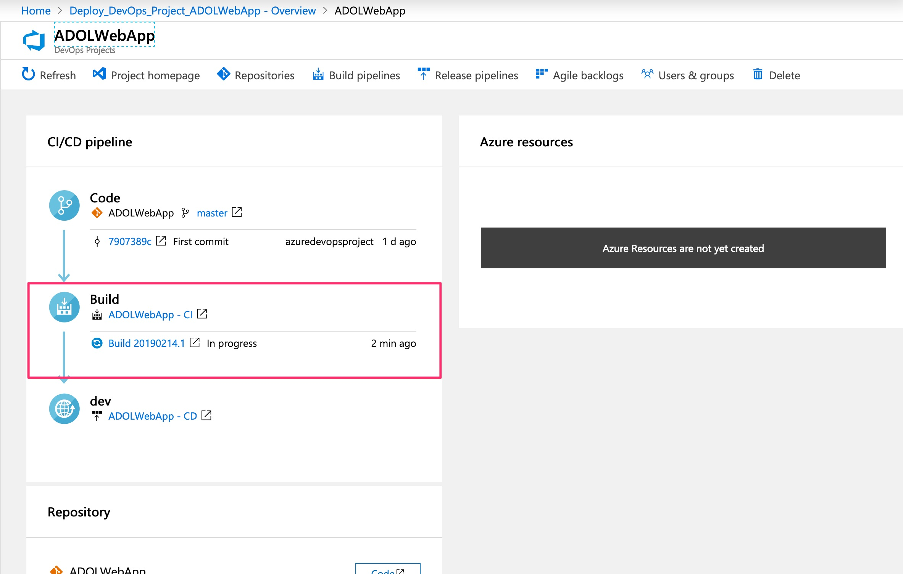

The section marked dev is showing that a continuous deployment pipeline has been created and is either due to run, is running or has run:

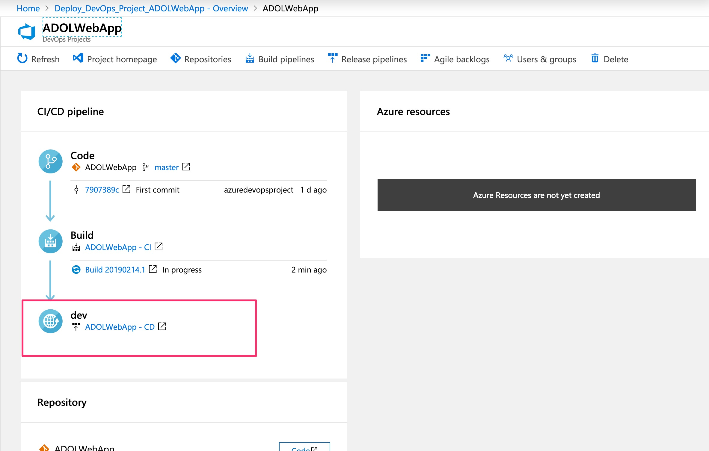

Wait a few minutes or click refresh until the deployment is complete:

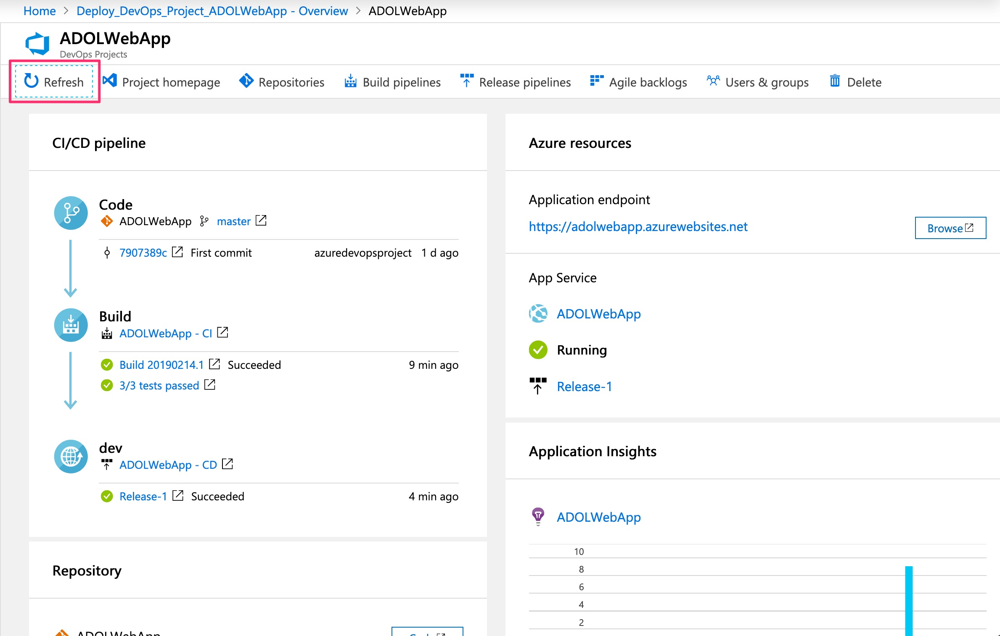

In the Azure resources section we can see that an Azure Web App has been created, that it is running and Release-1 has been successful. Click on the application endpoint URL to view the newly deployed web application:

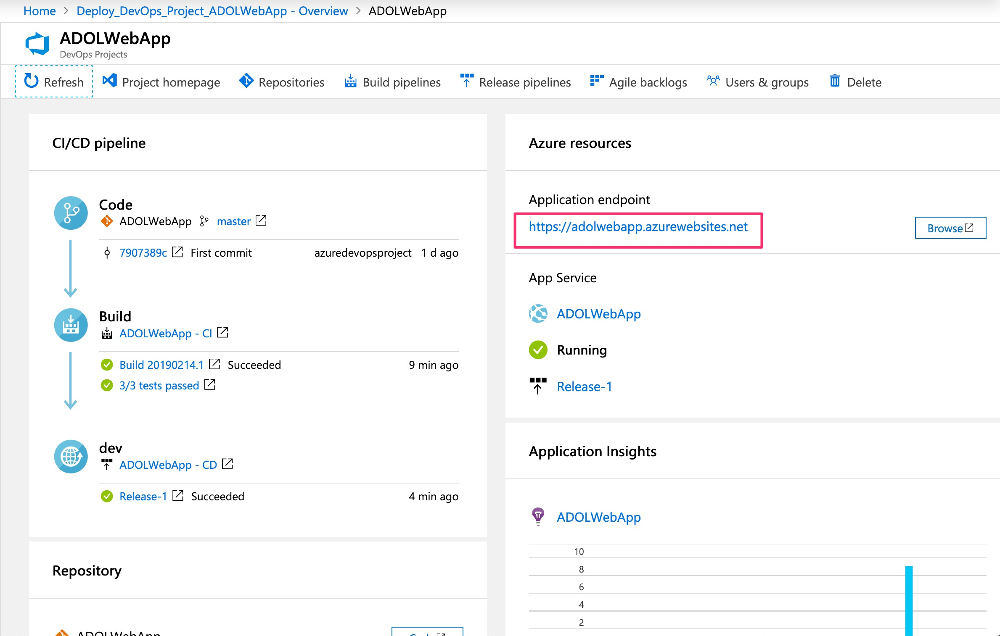

You should see your newly created and deployed web application running in Azure:
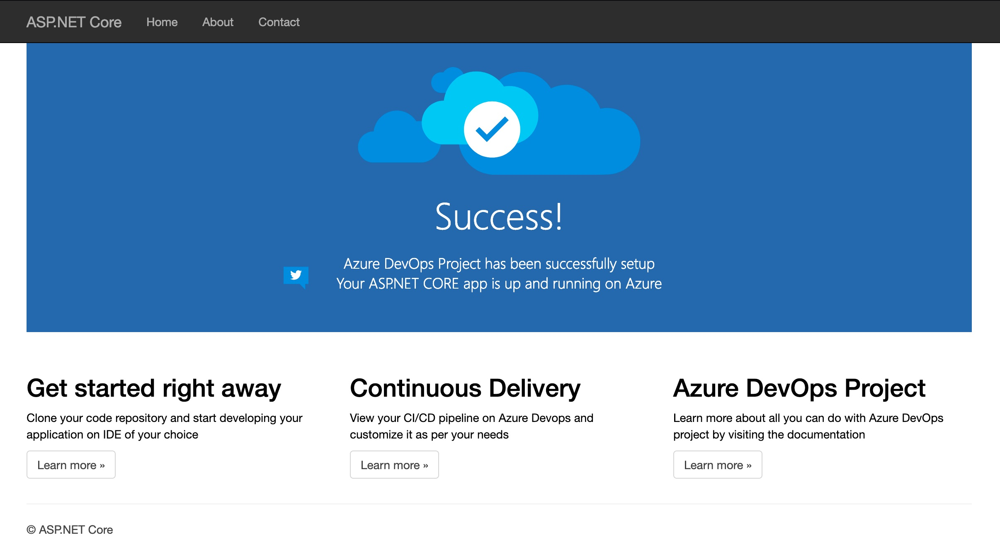

# Step 3: Exploring the Azure DevOps pipeline

In this step you'll explore the Azure DevOps project itself.

Return to the Azure Portal page and you can also see a number of links into the Azure DevOps project, such as build and release pipelines. Click on the Project homepage:

This will take you into the created Azure DevOps project:

Select Pipelines | Builds:

You will see the build definition and the build history (in this case 1 successful build):

Let's start by looking at the build logs. Click on the build in the build history:
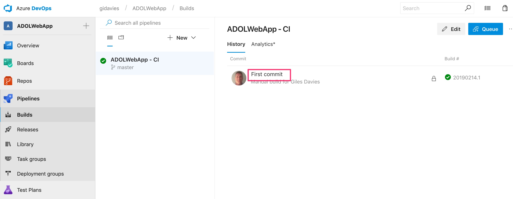

Then select the Summary tab:
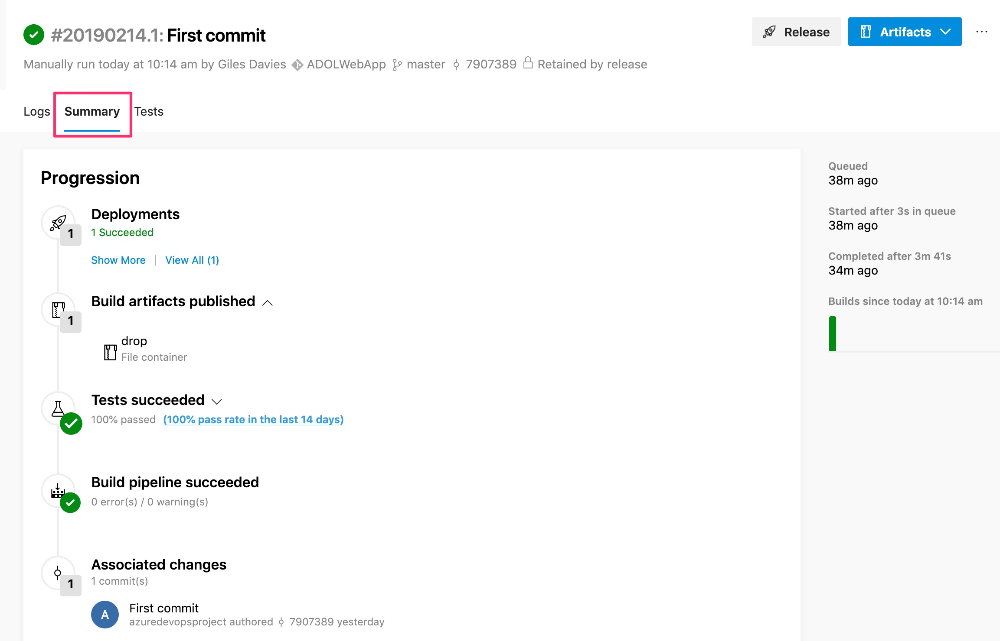

The summary is showing (in order from top to bottom) that:

- The build has resulted in a deployment, which we'll explore later.
- The build has produced some artifacts (the web application to be deployed).
- 100% of the unit tests in the build have been successful.
- The overall build passed.
- The Git commit that the build was related to.

Now click on Pipelines | Builds again on the left hand side and return to the build history page and select Edit:

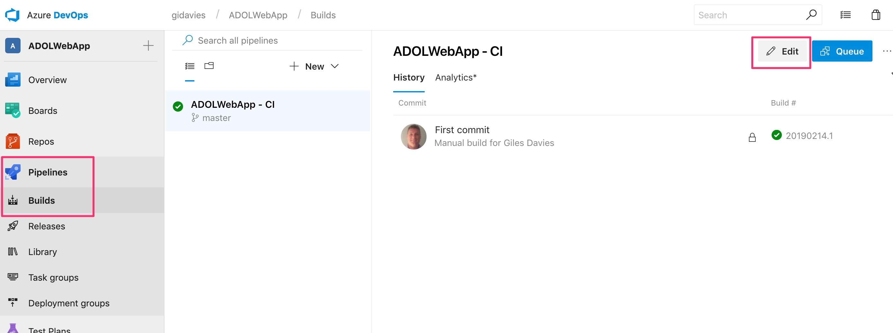

Have a look at the Build definition to understand what it's doing but there are a few key points to make:

Select the Pipeline area and note that the build is using a hosted build agent, in other words, an agent that you don't need to manage or maintain. [More information on agents and choosing between a hosted and a private agent](https://docs.microsoft.com/en-us/azure/devops/pipelines/agents/pools-queues?view=azure-devops) 

Now select Get sources to see where the source code is located. In this case it is in Azure Repos but it can be in an external repo. Also note that this build definition will be triggered when any changes are made to the master branch. You may end up with different build definitions for different branches:

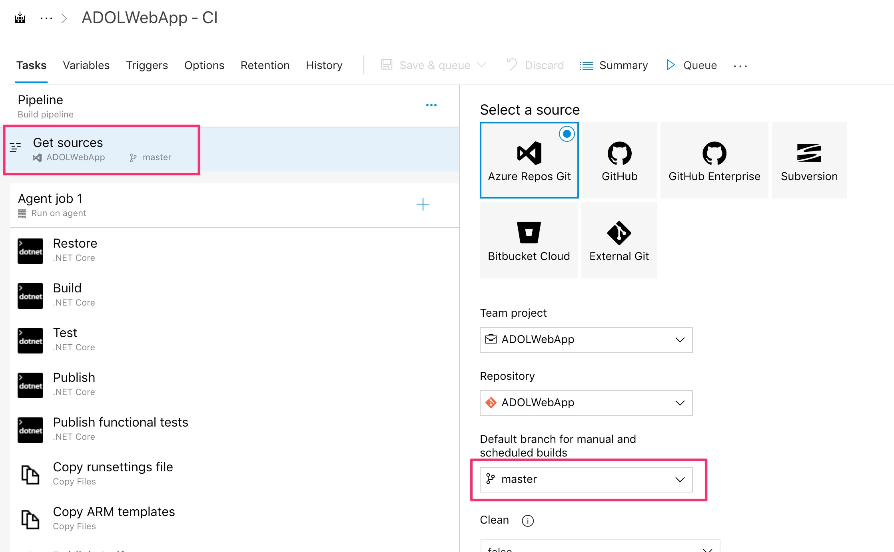

The main part of the build definition is the sequence of tasks that in this case restore dependencies, build the app and then run unit tests before making the output of the build available in a drop location. It also builds and make available functional tests to be run in the later release pipeline:

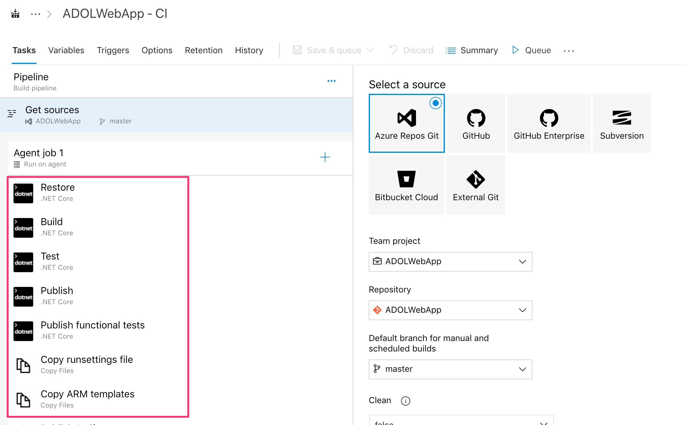

Note that you can choose from a library of tasks by selecting the + button, and that there are more tasks available in the marketplace:

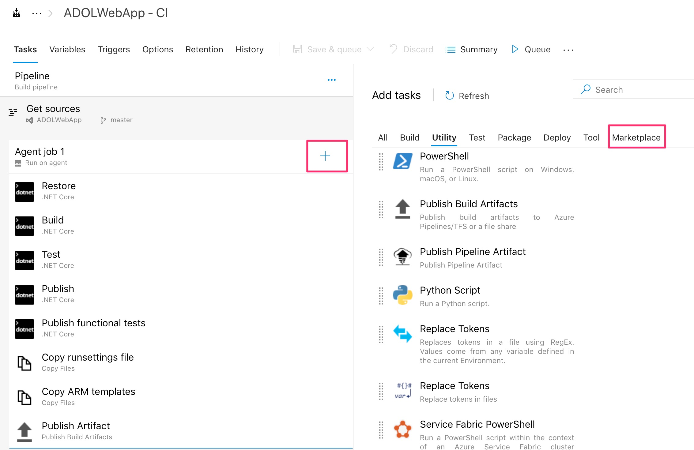

Finally look at the Triggers tab to see that this build has been set to trigger whenever anyone commits to the source code repo and branch specific above i.e. continuous integration has been enabled:

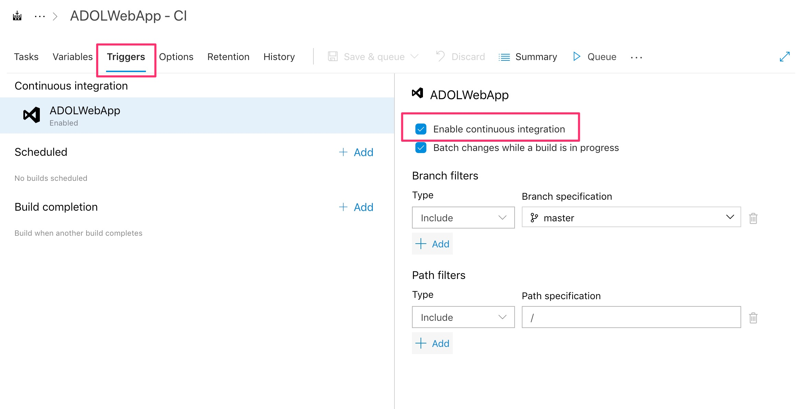

[<- Introduction](https://github.com/gidavies/AzureDevOpsLab/blob/master/README.md) | [Lab 2: Agile planning using Azure Boards ->](https://github.com/gidavies/AzureDevOpsLab/blob/master/AzureDevOpsLab2.md)
