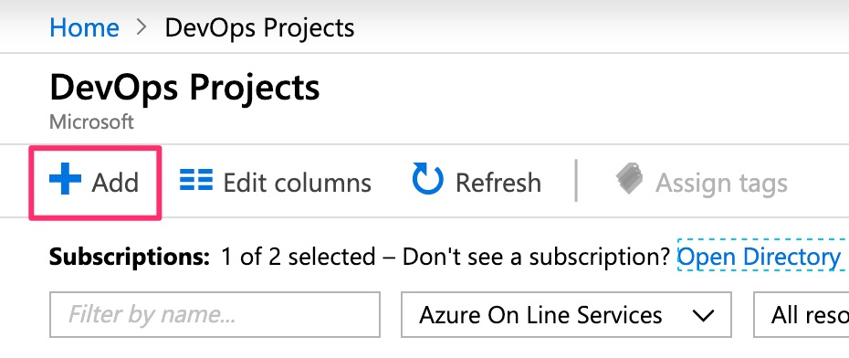
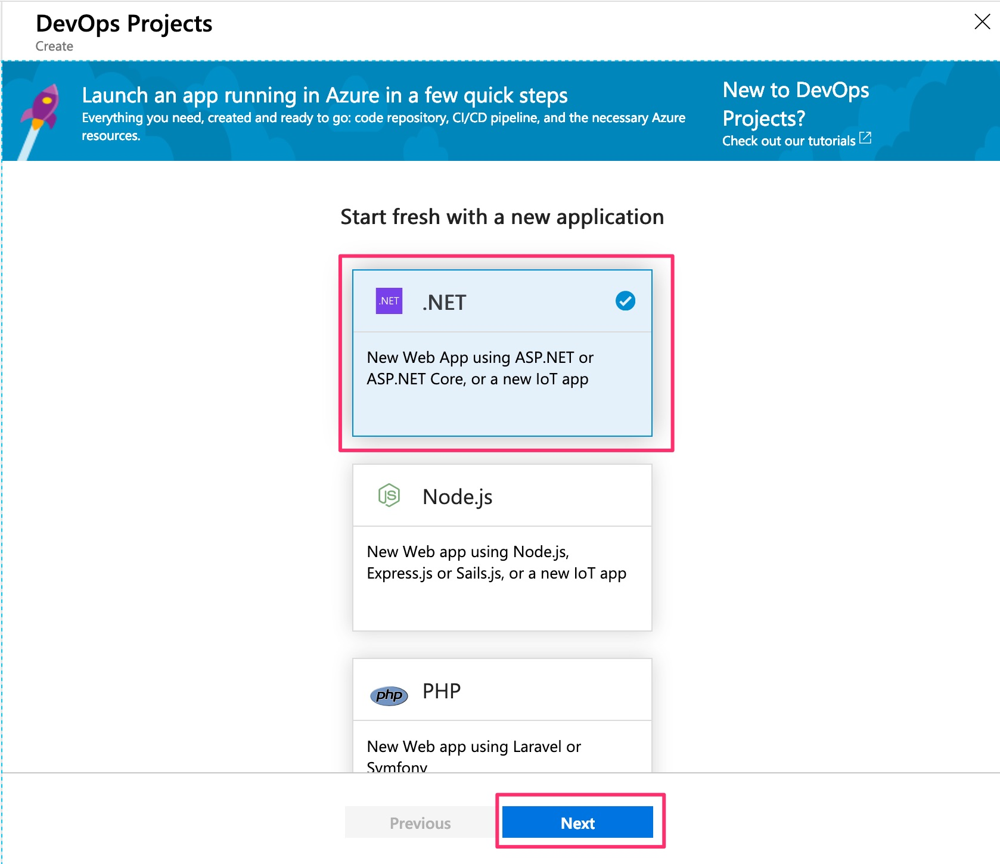
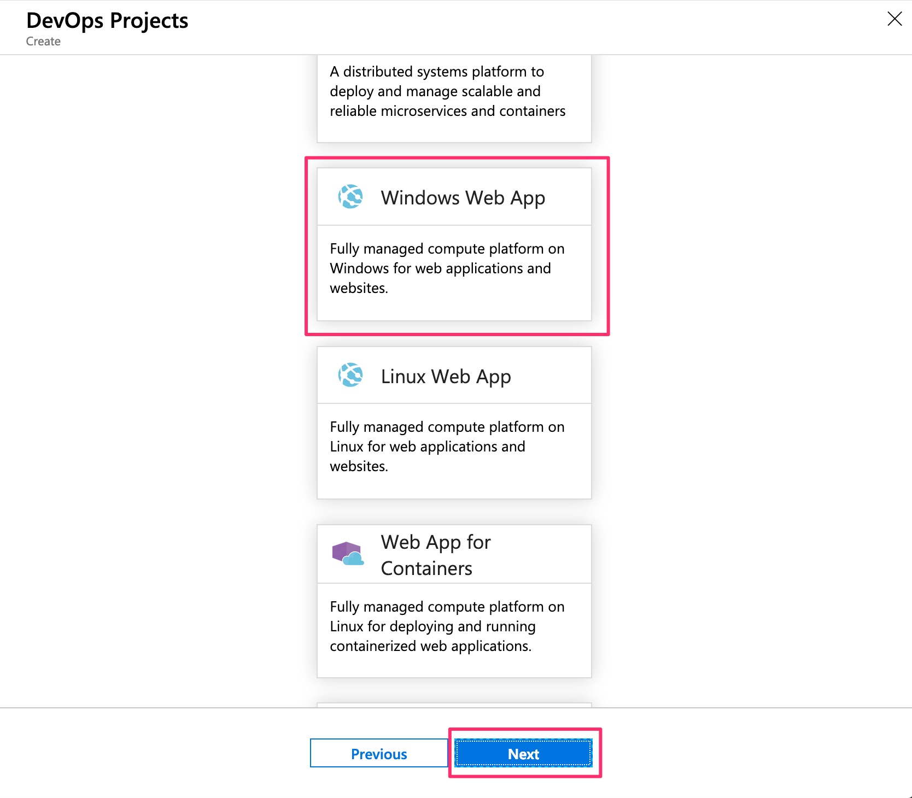
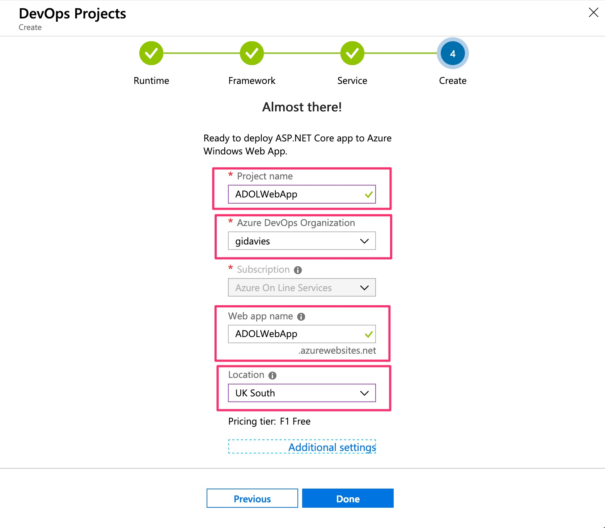
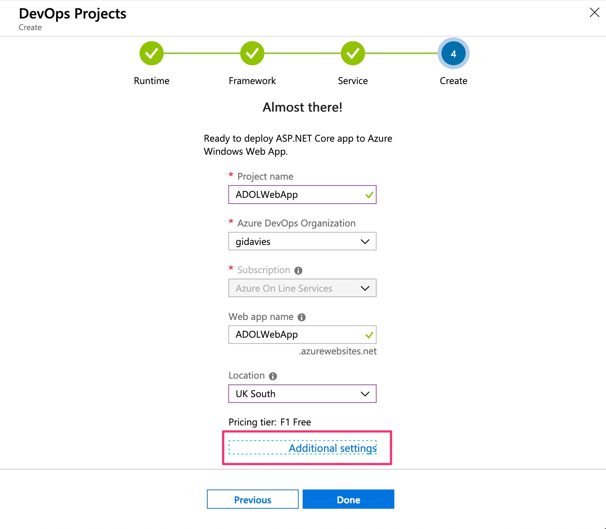
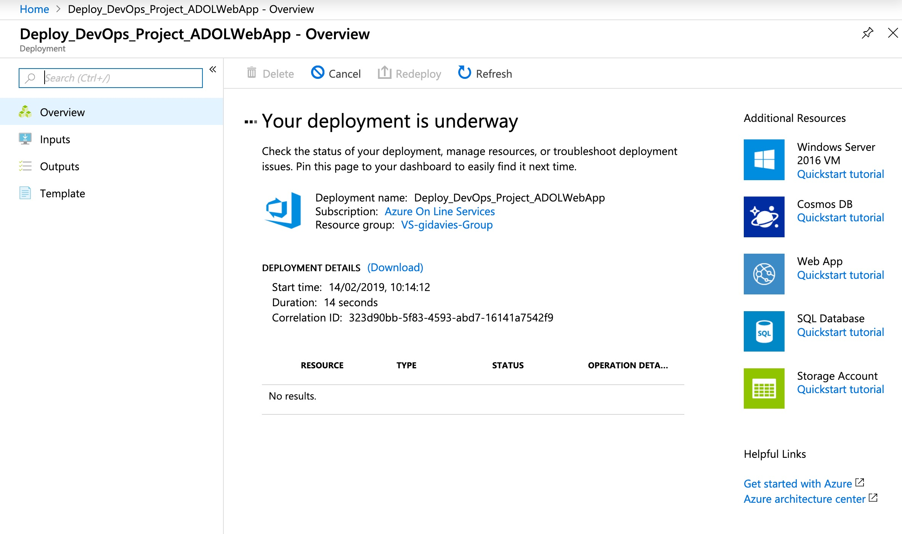
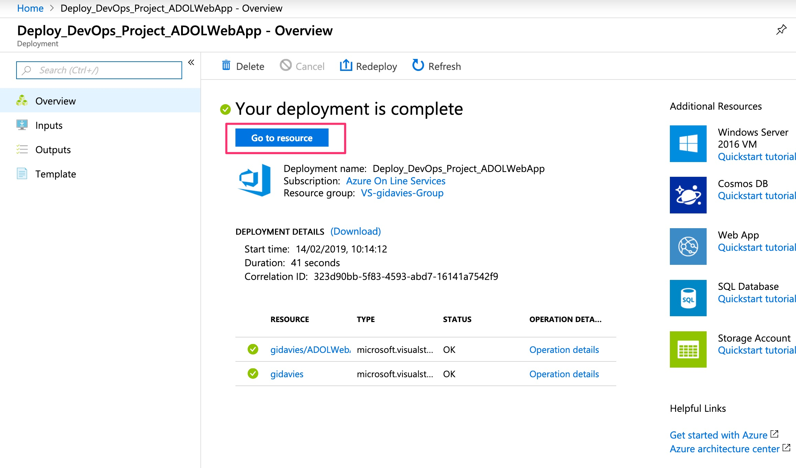

# Lab 1: Create the basic pipeline

This lab will create a working release pipeline using Azure DevOps that will form the basis of the later labs.

# Step 1: Create an Azure DevOps Project

This step will use the Azure Portal DevOps Projects to create the complete initial pipeline.

- In a browser navigate to the [Azure Portal](https://portal.azure.com) (https://portal.azure.com).
- Login with the identity associated with the Azure subscription you want to use.
- Navigate to the DevOps Projects service. Select All services, then type DevOps and then click DevOps Projects. Note that if you select the favourite star then this service will appear in the favourites list on the left hand side to avoid searching for it in future:

- Click + Add:

- Select the programming language for the application. Note that there are a wide range of options but for the purposes of this lab select .NET and then click Next:

- Now choose the framework for the selected language. In this case select ASP.NET Core (as it's cross platform) and then Next:

- Select the target Azure service. There are many options but for this lab select the Windows Web App (chosen as there is a free tier so this lab can be completed without incurring any costs on your subscription). Click Next:

- Provide a project name. This will also be the default Web app name, but note that the Web app name needs to be unique so you may need to try different Web app names until a green tick is shown. Set the Azure region that you wish to run the service in, and also select the Azure DevOps organisation that you wish to use:

- Select additional settings:

- Note that if you don't have, or want to create a different, Azure DevOps Organisation you can choose to do so here. You may want to set the Pricing tier to the F1 Free and also change where the Application Insights telemetry will be located. Click OK when done:

- If all the settings are correct then click Done:

- Wait a short while (30 secs) and you should see that the deployment is underway:

- Wait a little longer (a couple of minutes, click refresh if impatient) and you should see that the deployment is complete. Click Go to resource:

# Step 2: Explore the created resources

[<- Introduction](https://github.com/gidavies/AzureDevOpsLab/blob/master/README.md) | [Lab 2: Agile planning using Azure Boards ->](https://github.com/gidavies/AzureDevOpsLab/blob/master/AzureDevOpsLab2.md)
