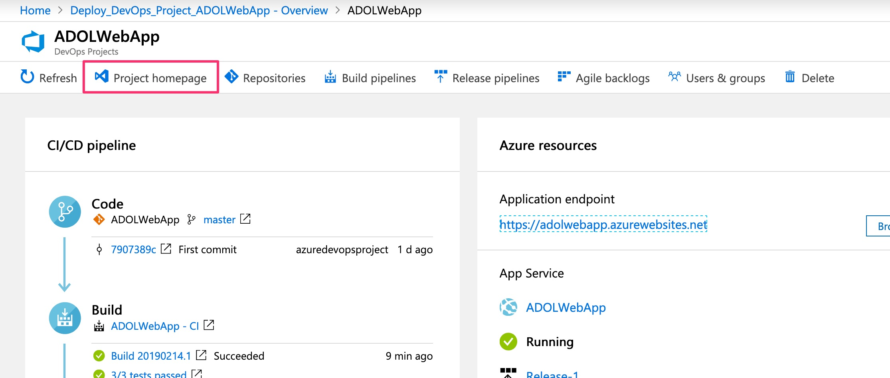
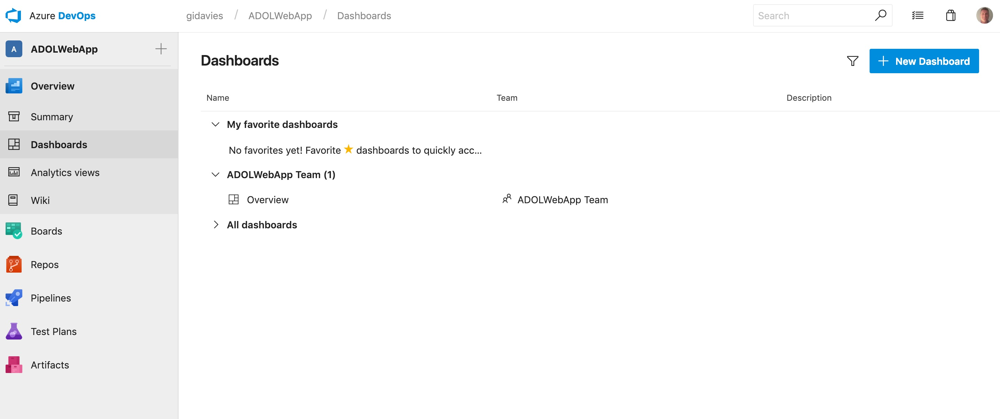
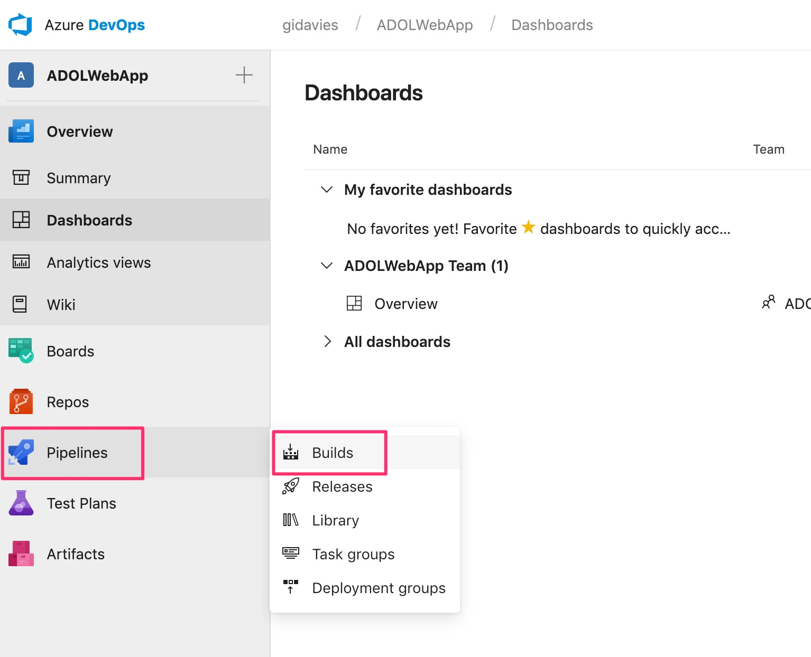
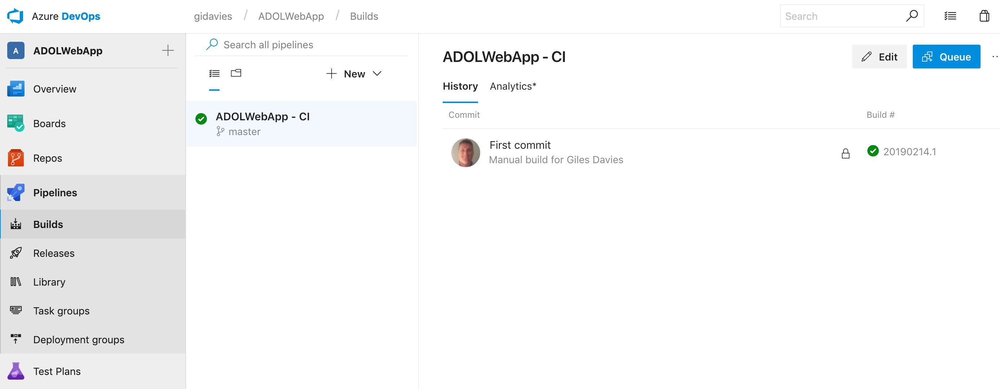
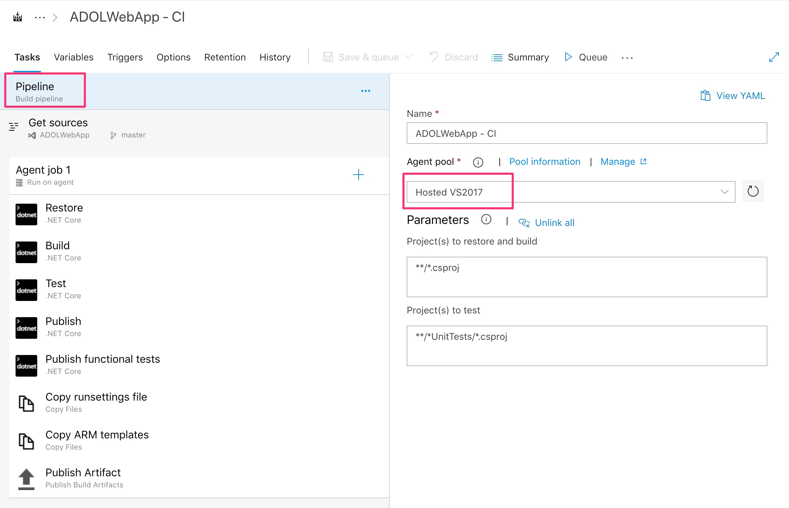

# Lab 2: Exploring the created Azure DevOps build pipeline

The end to end pipeline has been created and has deployed your application into Azure. In this lab we will explore and understand the continuous integration build pipeline that has been created.

# Understanding the continuous integration build definition

In this step you'll explore the build definition created in the Azure DevOps project.

Return to the Azure Portal page and you can also see a number of links into the Azure DevOps project, such as build and release pipelines. Click on the Project homepage:

This will take you into the created Azure DevOps project:

Select Pipelines | Builds:

You will see the build definition and the build history (in this case 1 successful build):

Let's start by looking at the build logs. Click on the build in the build history:

Then select the Summary tab:

The summary is showing (in order from top to bottom) that:

- The build has resulted in a deployment, which we'll explore later.
- The build has produced some artifacts (the web application to be deployed).
- 100% of the unit tests in the build have been successful.
- The overall build passed.
- The Git commit that the build was related to.

Now click on Pipelines | Builds again on the left hand side and return to the build history page and select Edit:

Have a look at the Build definition to understand what it's doing but there are a few key points to make:

Select the Pipeline area and note that the build is using a hosted build agent, in other words, an agent that you don't need to manage or maintain. [More information on agents and choosing between a hosted and a private agent](https://docs.microsoft.com/en-us/azure/devops/pipelines/agents/pools-queues?view=azure-devops) 

Now select Get sources to see where the source code is located. In this case it is in Azure Repos but it can be in an external repo. Also note that this build definition will be triggered when any changes are made to the master branch. You may end up with different build definitions for different branches:

The main part of the build definition is the sequence of tasks that in this case restore dependencies, build the app and then run unit tests before making the output of the build available in a drop location. It also builds and make available functional tests to be run in the later release pipeline:

Note that you can choose from a library of tasks by selecting the + button, and that there are more tasks available in the marketplace:

Finally look at the Triggers tab to see that this build has been set to trigger whenever anyone commits to the source code repo and branch specific above i.e. continuous integration has been enabled:

[<- Lab 1: Create the basic pipeline](https://github.com/gidavies/AzureDevOpsLab/blob/master/AzureDevOpsLab1.md) | [Lab 3: Exploring the created Azure DevOps release pipeline ->](https://github.com/gidavies/AzureDevOpsLab/blob/master/AzureDevOpsLab2.md)
