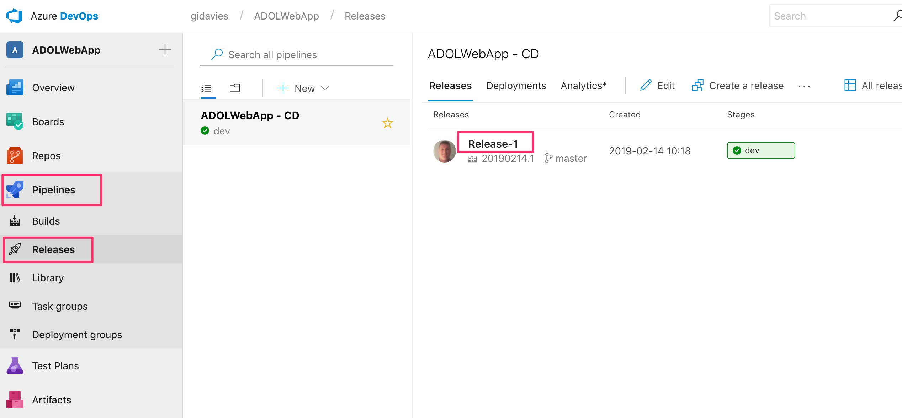
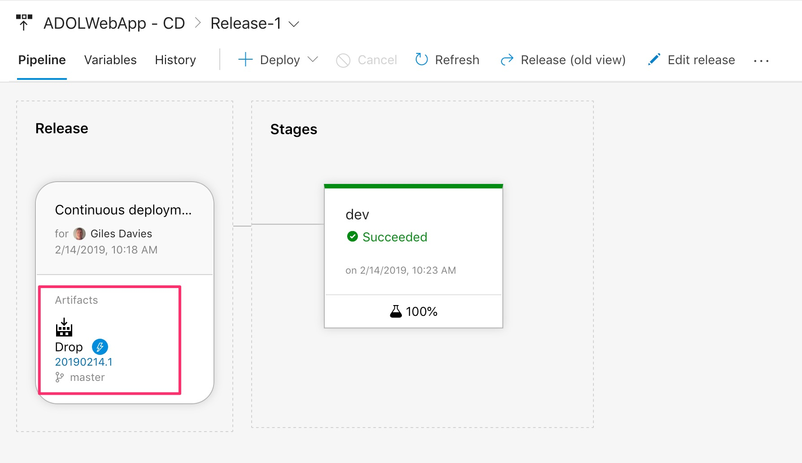
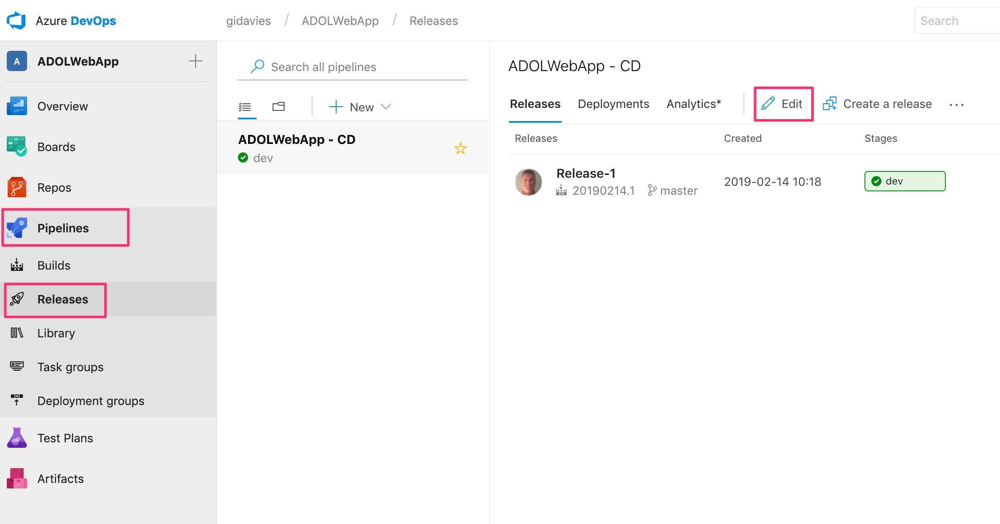
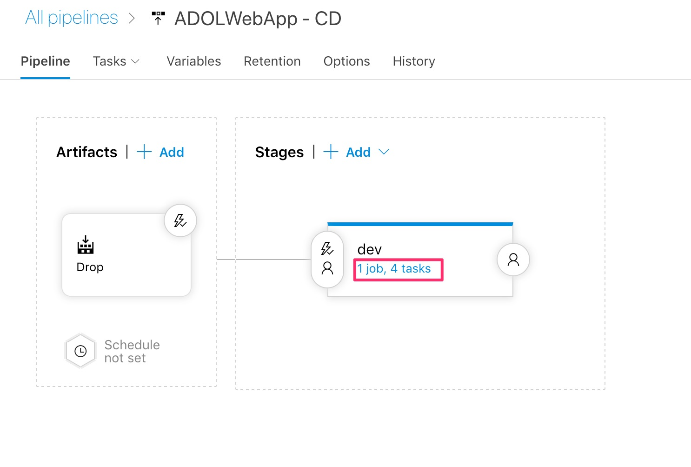
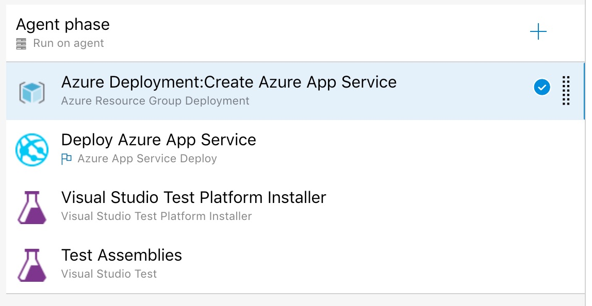
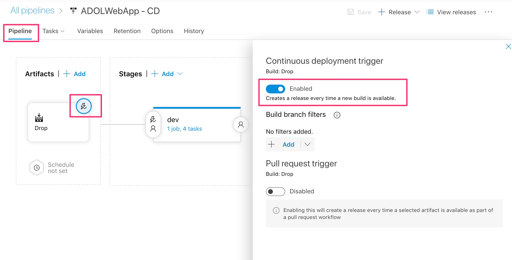

# Lab 3: Exploring the created Azure DevOps release pipeline

In this lab we will explore and understand the continuous deployment release pipeline that has been created.

# Understanding the continuous deployment release definition

In Azure DevOps go to Pipelines | Releases to view the created continuous deployment release definition. In the same way as the build pipeline you can see the history of releases. Select the first release (Release-1):

The release pipeline views shows us that there is a single stage (or environment) called "dev". We will add more in later labs but for now we can see that this has been successfully deployed to and 100% of the tests have been successful. We can also see that the artifacts that have been deployed have come from the continuous integration build. The release doesn't rebuild the application, it takes the output of the build and then promotes it across environments:

Now return to the release pipelines overview (Pipelines | Releases) and select Edit:

To view the tasks executed in the dev stage, click on the link where it says 1 job, 4 tasks:

This is now very similar to the build pipeline view. Start by selecting the agent phase and notice that the release pipeline also uses an agent and that it is set to use the same agent (a hosted agent) as the build pipeline:

Take a look at the tasks themselves (and like in builds more are available from the library accessed via the + button). The tasks here:

- Provision an Azure App Service (PaaS) using the Azure Resource Group task. The task references an ARM template, a JSON file that declares any combination of Azure resources to provision or update. This means that the infrastructure is created on demand and as part of the pipeline.
- Deploy the web application built in the CI build into the App Service provisioned in the first step.
- Install the latest version of the Visual Studio Test Platform onto the machine that the agent is running on.
- Execute the automated funtional tests (in this case Selenium) against the deployed web application.

Return to the pipeline view (Pipeline tab) and click on the lightning flash on the artifacts to observe that the trigger for this release pipeline is to continuosly deploy whenever there is a successful build:

You have now looked at some of the key elements of the release definition that provides the continuous deployment pipeline.

[<- Lab 2: Exploring the created Azure DevOps build pipeline](https://github.com/gidavies/AzureDevOpsLab/blob/master/AzureDevOpsLab2.md) | [Lab 4: Agile planning using Azure Boards ->](https://github.com/gidavies/AzureDevOpsLab/blob/master/AzureDevOpsLab4.md)
