# Lab 4: Agile planning with Azure Boards

In this lab we will use Azure Boards to plan and track work in the project.

# Step 1: Add some items to the Product Backlog

Navigate to the product backlog by selecting Boards | Backlogs:

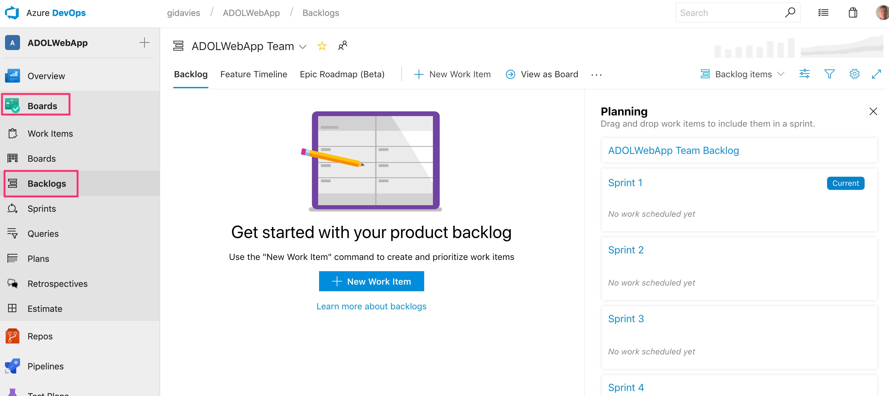

You will see that the backlog is empty and that no work has been assigned to any Sprints. Add an item to the backlog by selecting + New Work Item:

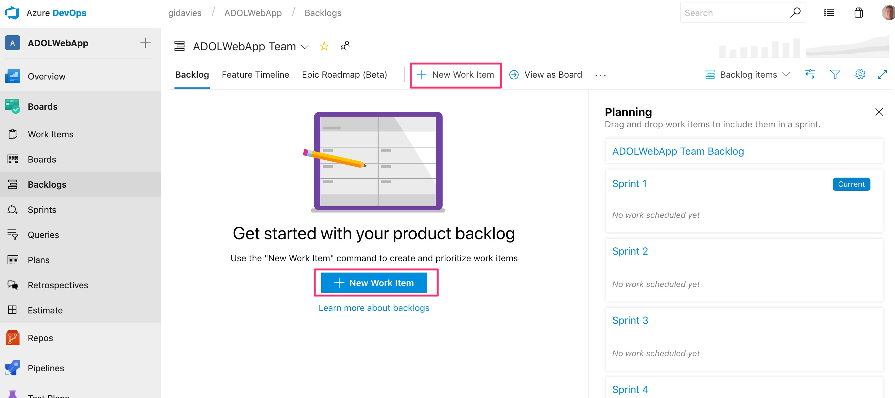

Give the work item a title e.g. "Update the about page in the web application" and click the Add to bottom button:

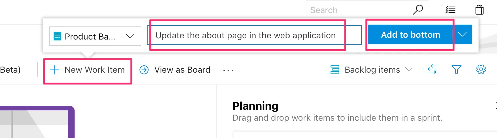

Repeat and add at least one more product backlog item. Then drag and drop the items up and down the backlog to raise or lower their relative priority:

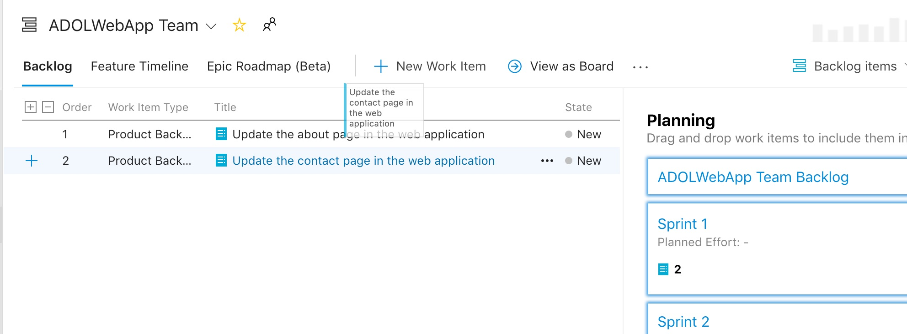

Many teams prefer to visualise their product backlogs, and progress, in a board rather than a list view. Select View as board:

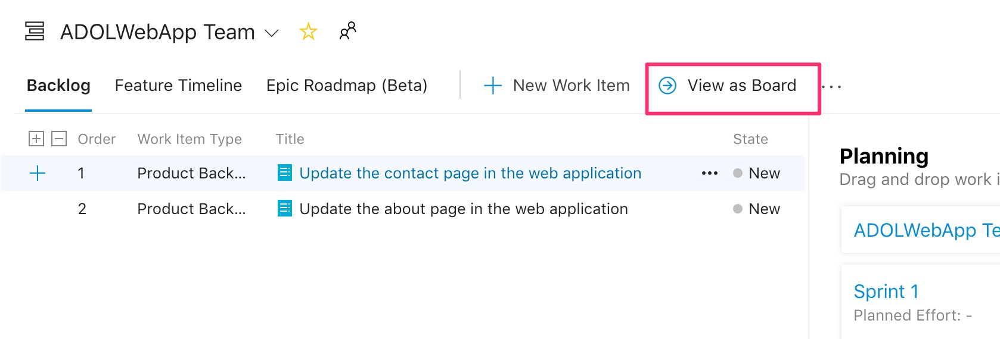

And you will now see the same work items in a board view:

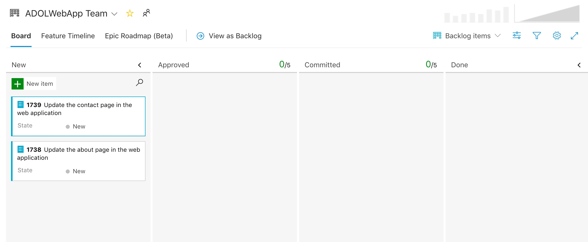

Try adding more work items in the board, and reordering the work items in the New column:

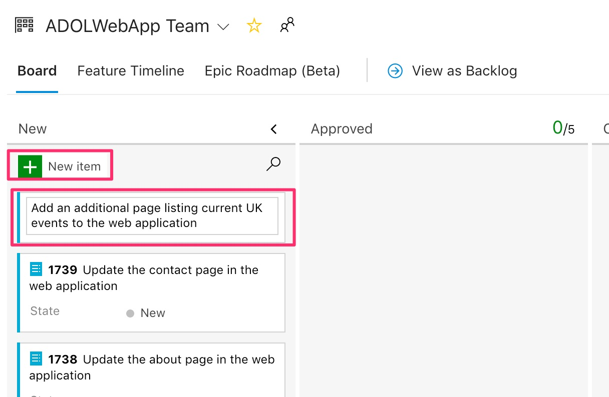

You can add more columns, rename existing columns, add swimlanes, choose which fields to show, apply colour stylings and more in the settings. Explore the settings as you wish and play around with the board:

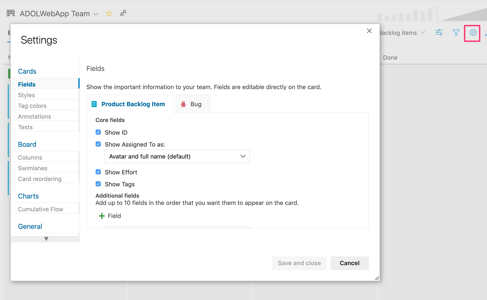

# Step 2: Add a new item and create a branch to work on it

In the Board create a new item called "Update home page heading":

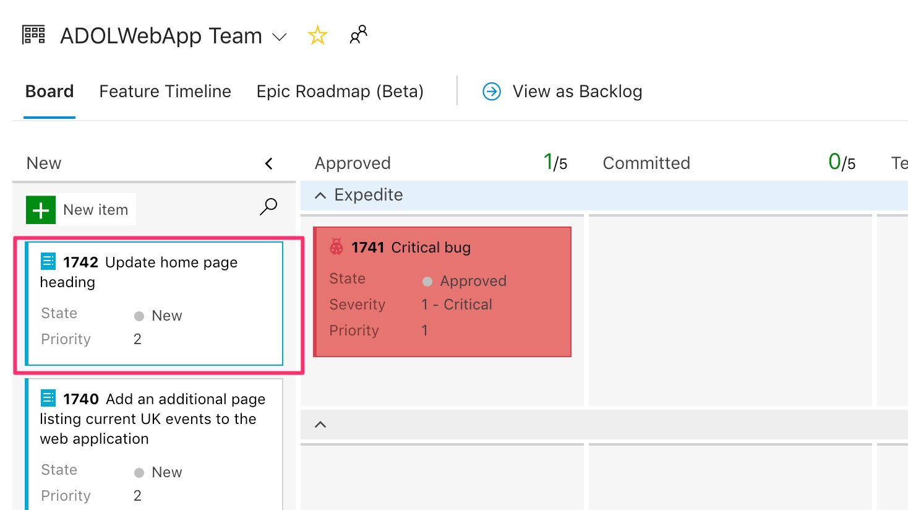

Move (drag and drop) it to the approved column to indicate that you are going to start work on it:

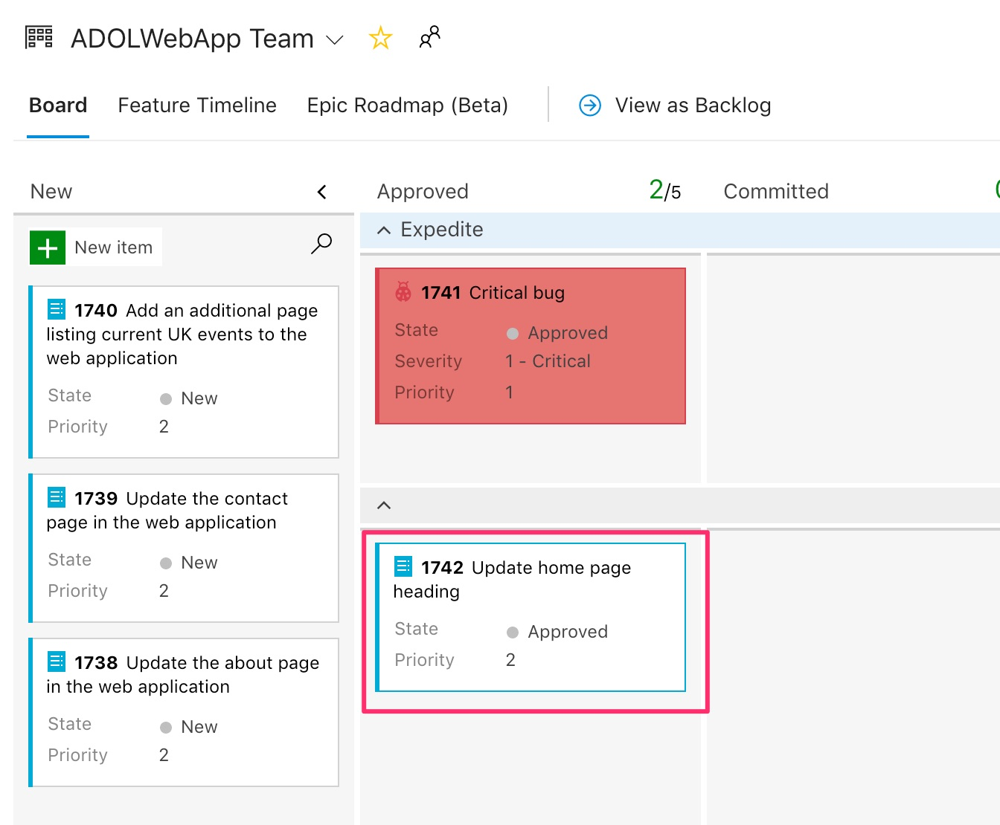

Click on the card's three dots and select New branch:

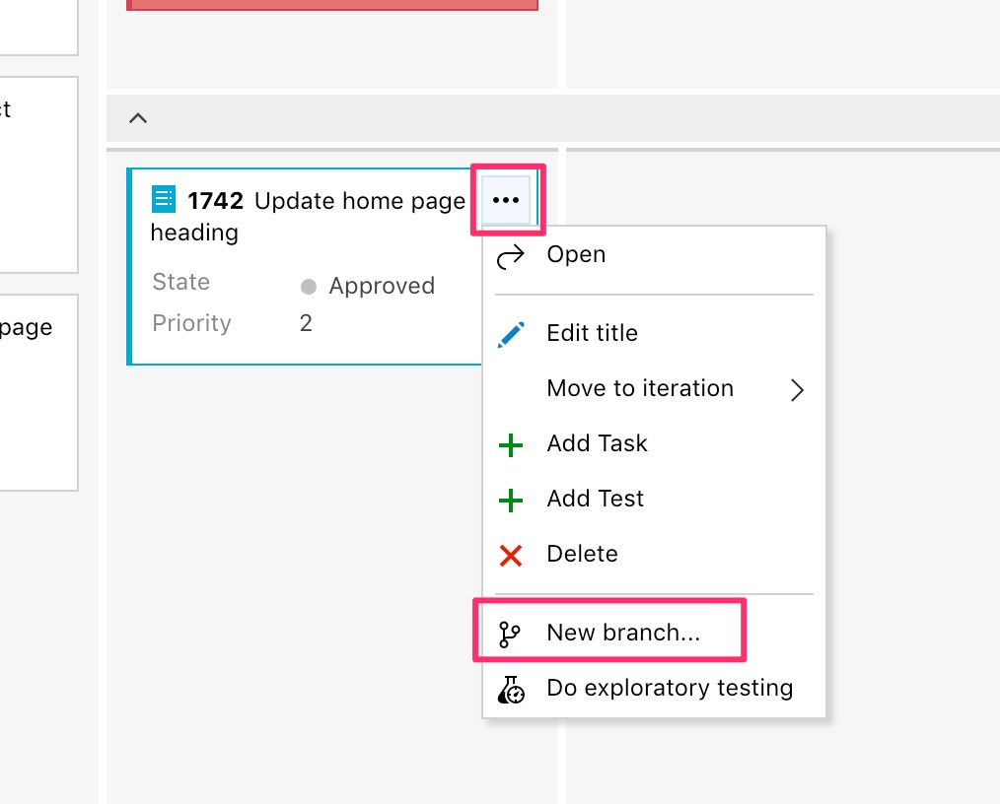

Give the branch a name (no spaces) and notice that the branch is linked to the product backlog item (you could link to others if desired) and will be branching from the master branch. Click Create branch:

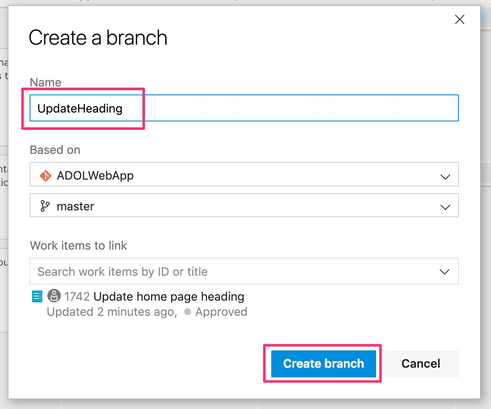

You will be redirected to the Azure Repos file area and you will see that the new branch you have just created is now available alongside the master branch.

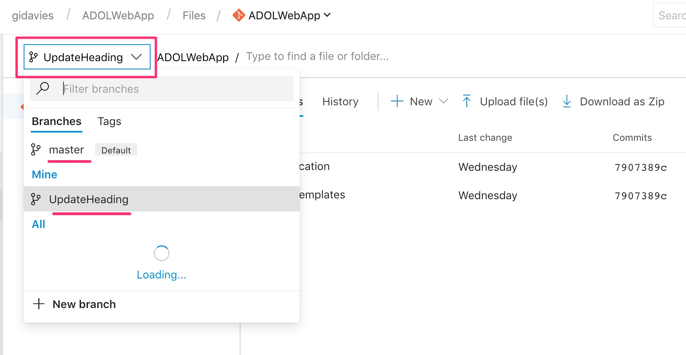

You have now added work to a board, and are ready to make code changes in an independent branch without directly impacting the master branch. In the next lab we will change the branch and merge in back into the master branch via a Pull Request.

[<- Lab 3: Exploring the created Azure DevOps release pipeline](https://github.com/gidavies/AzureDevOpsLab/blob/master/AzureDevOpsLab3.md) | [Lab 5: Deploy via a Pull Request ->](https://github.com/gidavies/AzureDevOpsLab/blob/master/AzureDevOpsLab5.md)
