# Lab 5: Deploy changes via a Pull Request

This lab will step through making a (trivial) code change and submitting that change via a Pull Request, which, when approved, will then trigger the CI and CD pipeline already in place.

# Step 1: Clone the new branch locally

In the Repos | Files area select Clone and click the copy button to the right of the clone URL:

At the command line (terminal/powershell etc.) switch to a folder within which you'll be happy to have the source code top level folder cloned to (e.g. C:\). Then clone the repo by typing "git clone" and paste in the URL from above. If prompted sign in using the same credentials you're using to access Azure DevOps:

Change to the folder that's been cloned and then type "code ." to open Visual Studio Code with the contents of the current folder:

Expand the Application and ARM folders and you can see that at the top level are folders for the application itself, unit tests, functional tests and the ARM templates:

We now need to switch to the branch created earlier. In Visual Studio Code enter the Command Palette by using the View | Command Palette or the OS specific shortcut keys (Windows + P, or CMD + P on a Mac):

Select the Git: Checkout to... option by starting typing and then select the option:

Select the new branch that you created earlier:

You have now cloned the repo and switched to the new branch inside Visual Studio Code. You can confirm this by looking at the bottom left status bar in Code, where you should see the branch name:

# Step 2: Make the code change and commit and push the change.

In Visual Studio Code, expand the aspnet-core-dotnet-core\Views\Home folder and open the Index.cshtml file. Just change the text that says "Success!" to something else e.g. "Version 2" or anything that you will recognise later when it's redeployed:

File | Save to save the change and then switch to the Git hub within Code where you should see that one file has been changed:

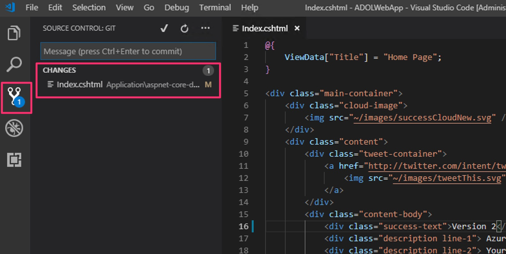

Add a commit message e.g. "Updated success title" and select the tick mark to commit the changes to the local repo:

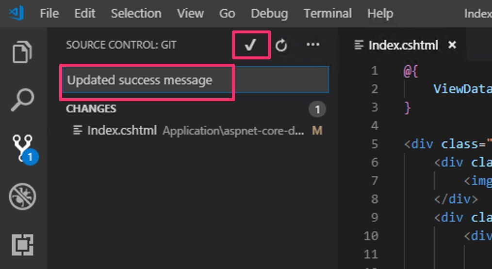

You may be prompted to stage your changes (Git allows you to have files that have changed but not been staged, so you can exclude them from commits), choose yes to choose each time, always to do this every time (and not be prompted again):

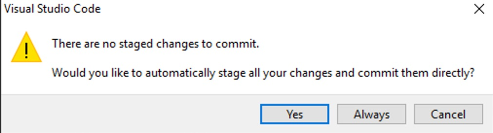

If you get prompted to enter your Git user name and email then you can select Open Git Log to see the two commands you need to run for this one time config for Git:

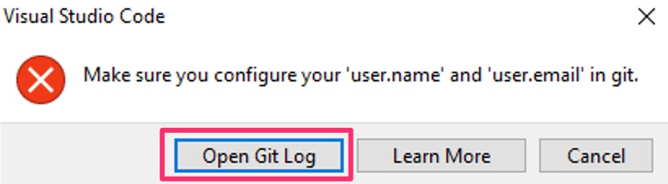

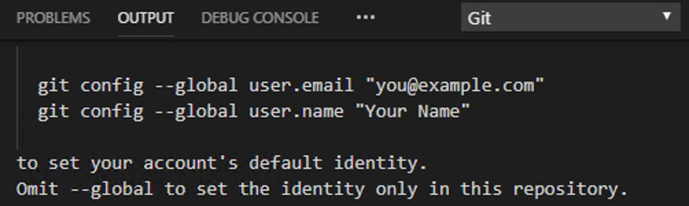

Switch to the command line and run these commands with any email address (it doesn't have to be the same as your Azure DevOps login id) and preferred user name:

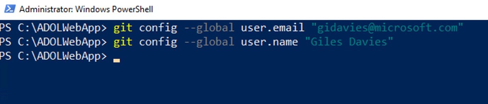

Then in Visual Studio Code repeat the commit step above (click the tick mark). You should then have no changes pending and should select Push from the three dot menu option to push your local commit to the remote Azure Repo:

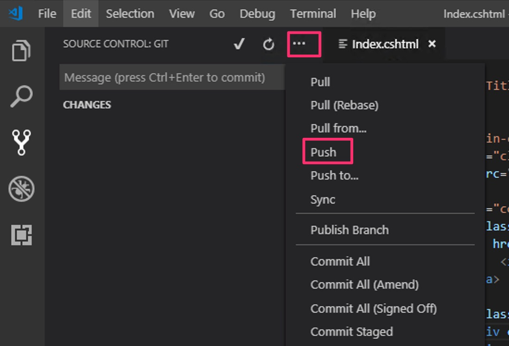

To confirm that the push has reached the Azure Repo, in Azure DevOps select Repos | Files, make sure that the correct branch is selected, click on history and see that the latest history is the commit you've just pushed:

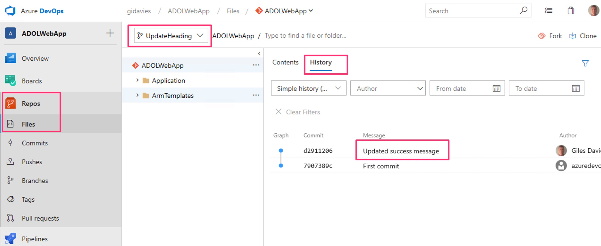

# Step 3: Create a Pull Request

The changed code is now sitting in the new branch but has not yet been merged into the master branch. To do that we can create a Pull Request so that these changes can be accepted into master, which will then trigger the build and release pipeline.

In Azure DevOps select Pull Requests in the Repo hub and you should see a suggestion that since you've just updated a child branch of master, that you may wish to create a Pull Request. Do so by clicking on "Create a Pull Request":

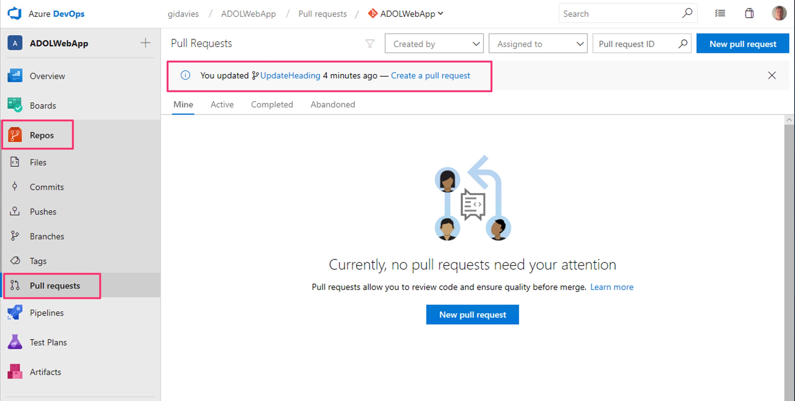

You don't need to change anything in the Pull Request but note that you can rename it, provide a better description, choose reviewers and see or change the associated work item(s). In this case it is already linked to to the work item we created the branch from earlier and this is very important in providing traceability from work items, to commits and on to builds and releases. Click Create when ready:

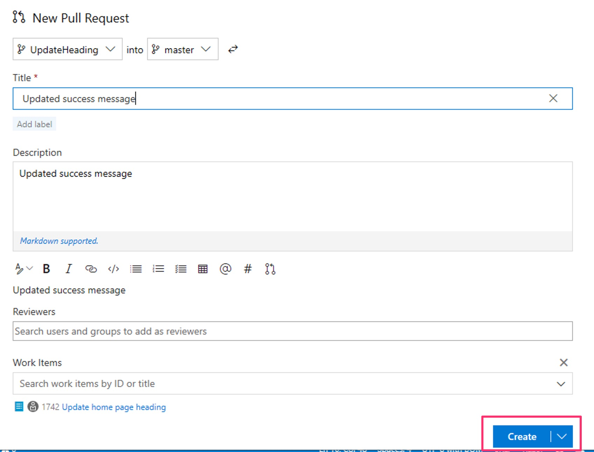

You have now created a request to merge your changes with the master branch. This provides the reviewers the opportunity to consider your changes and whether they will allow them, as well as automating quality with branch policies that can enforce work item linking, build passing, specific reviewers and more. As the developer you would typically now wait for someone else to approve the Pull Request but in this lab you can "swap hats" and pretend to review it - look at the files, add comments and when you're ready Approve the Pull Request and then mark it as Complete:

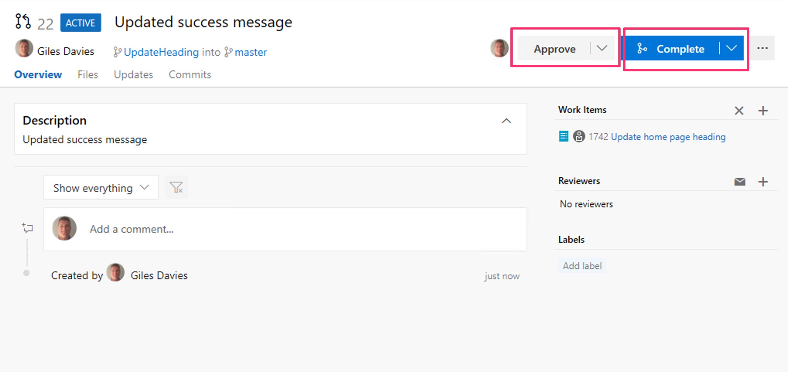

You can keep the defaults in completing the Pull Request but note that:

- Complete linked work items means the work item's state will change to the final completed state (i.e. it is finished).
- Delete the branch is fairly normal in Git - branches are lightweight and transient and if the work here is complete, then why keep the branch?
- Squash changes - if you had made many commits you may only want to have one summary commit message showing in the repo history so you can squash them down into a single commit. Here there is only one commit so it makes no difference.

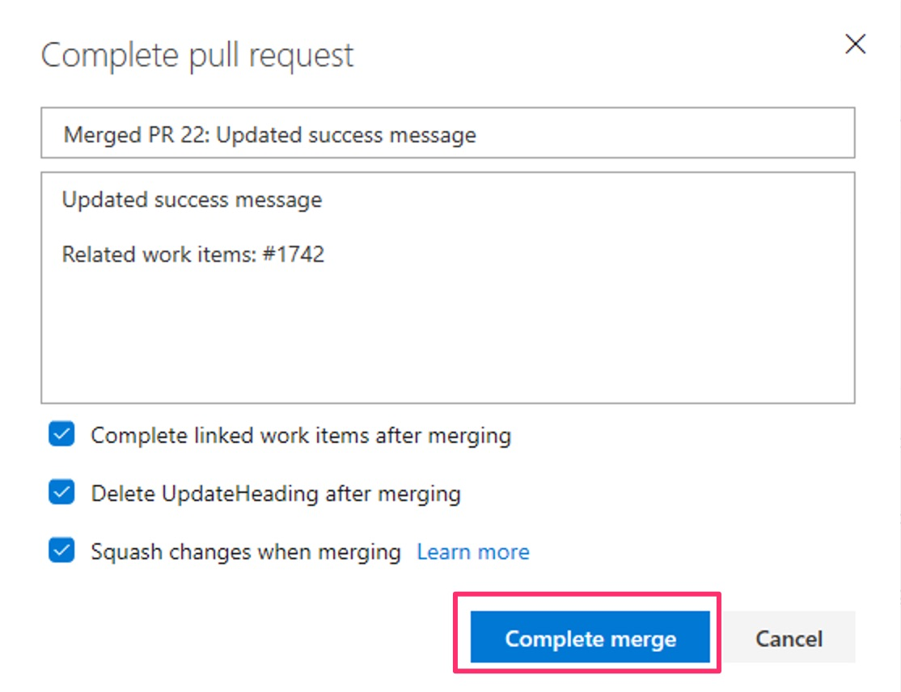

You should then see that the Pull Request has completed:

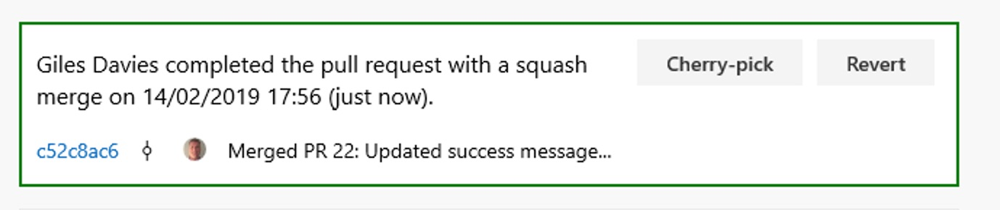

That now means that the master branch has been committed to (after the merge), and therefore the continuous integration build and the continuous deployment will now take place. Take a look at the build and release pipelines to track progress and when complete the deployed web application will now have the changed heading text on the home page:

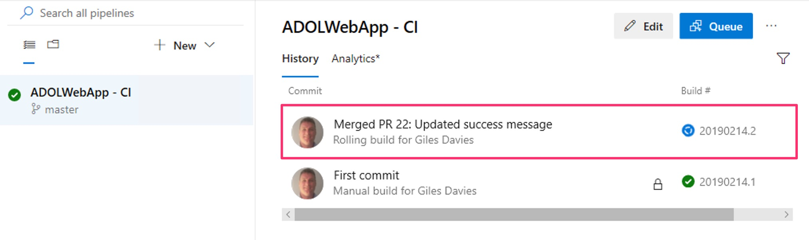

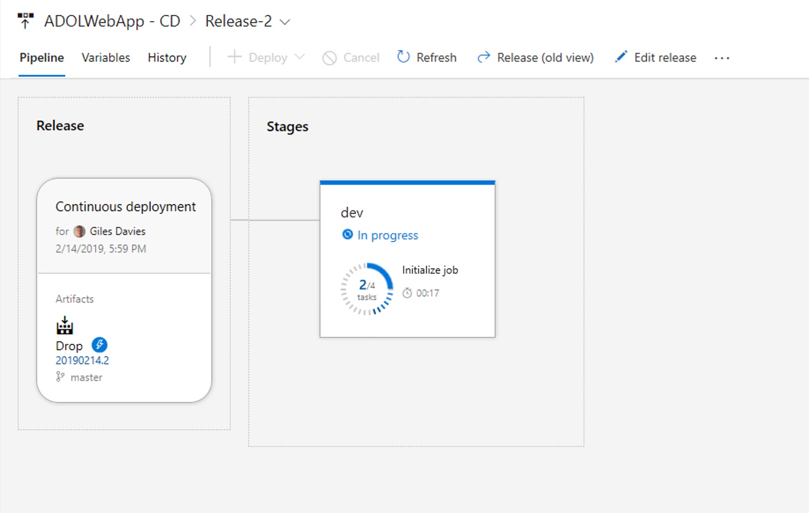

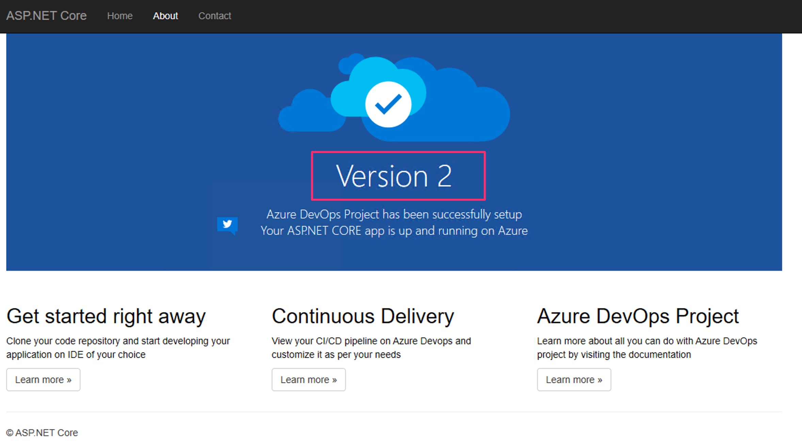

Congratulations! You have now created a branch from a work item, cloned that locally, made a change and merged that back into the master branch via a Pull Request, which has then triggered continuous integration and continuous deployment of the changes into the web application in Azure.

You are now able to continuously deliver value (changes in the application).

[<- Lab 4: Agile planning with Azure Boards](https://github.com/gidavies/AzureDevOpsLab/blob/master/AzureDevOpsLab4.md) | [Lab 6: Improve the continuous integration ->](https://github.com/gidavies/AzureDevOpsLab/blob/master/AzureDevOpsLab6.md)
