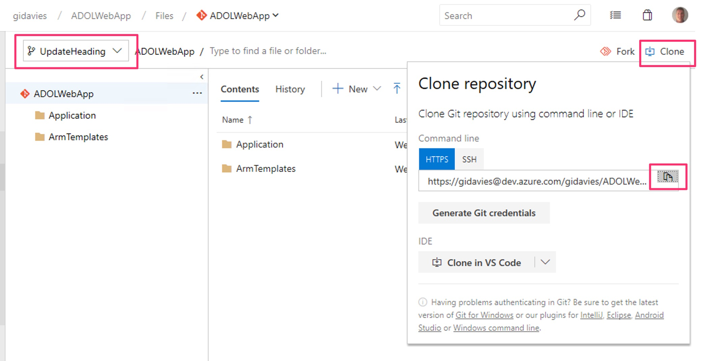
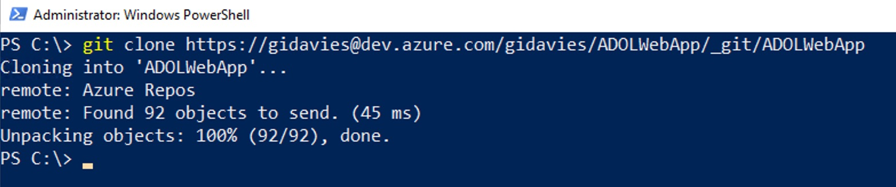
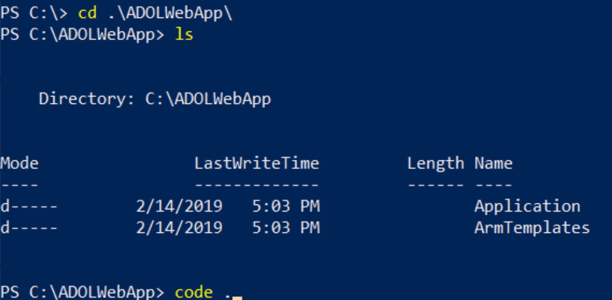
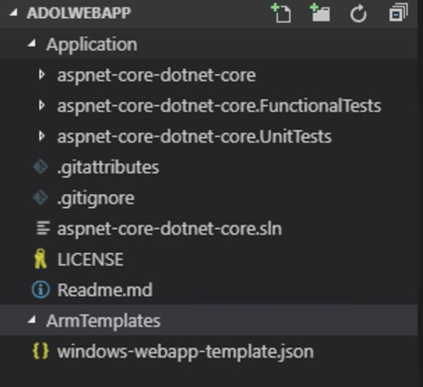
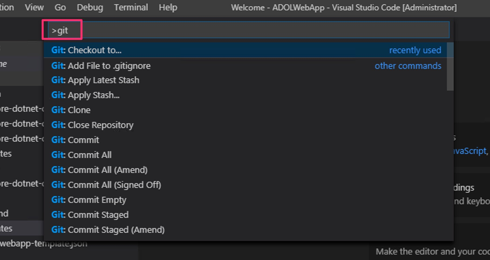
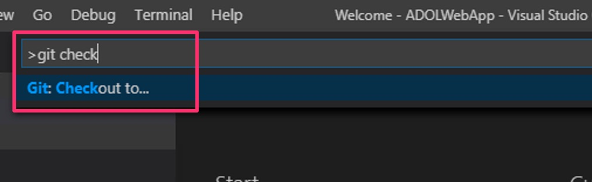
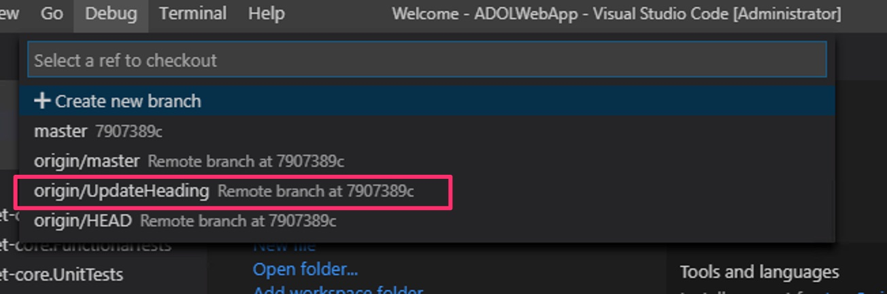
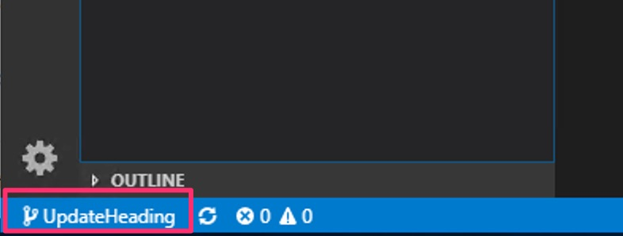

# Lab 5: Deploy changes via a Pull Request

This lab will step through making a (trivial) code change and submitting that change via a Pull Request, which, when approved, will then trigger the CI and CD pipeline already in place.

# Step 1: Clone the new branch locally

In the Repos | Files area select Clone and click the copy button to the right of the clone URL:

At the command line (terminal/powershell etc.) switch to a folder within which you'll be happy to have the source code top level folder cloned to (e.g. C:\). Then clone the repo by typing "git clone" and paste in the URL from above. If prompted sign in using the same credentials as you are using to access Azure DevOps:

Change to the folder that's been cloned and then type "code ." to open Visual Studio Code with the contents of the current folder:

Expand the Application and ARM folders and you can see that at the top level are folders for the application itself, unit tests, functional tests and the ARM templates:

We now need to switch to the branch created earlier. In Visual Studio Code enter the Command Palette by using the View | Command Palette or the OS specific shortcut keys (Windows + P, or CMD + P on a Mac):

Select the git: checkout to option by starting typing and then select the option:

Select the new branch that you created earlier:

You have now cloned the repo and switched to the new branch inside Visual Studio Code. You can confirm this by looking at the bottom left status bar in Code, where you should see the branch name:

# Step 2: Make the code change

# Step 3: Commit and push the change to the Azure DevOps repo

# Step 4: Create the Pull Request

[<- Lab 4: Agile planning with Azure Boards](https://github.com/gidavies/AzureDevOpsLab/blob/master/AzureDevOpsLab4.md) | [Lab 6: Improve the continuous integration ->](https://github.com/gidavies/AzureDevOpsLab/blob/master/AzureDevOpsLab6.md)
