# Lab 6: Extend the release pipeline

The release pipeline can be extended to encompass additional stages and approvals.

# Step 1: Add a QA stage

Navigate to the pipeline (Pipelines | Releases) and select Edit:

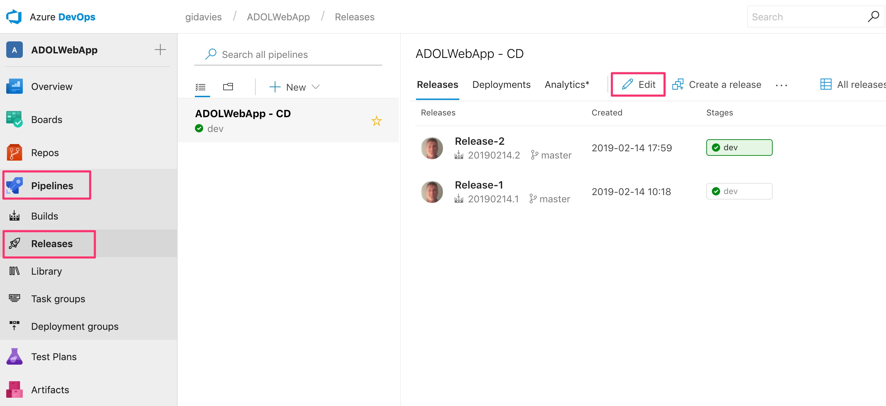

Move the mouse over the dev stage and select Clone:

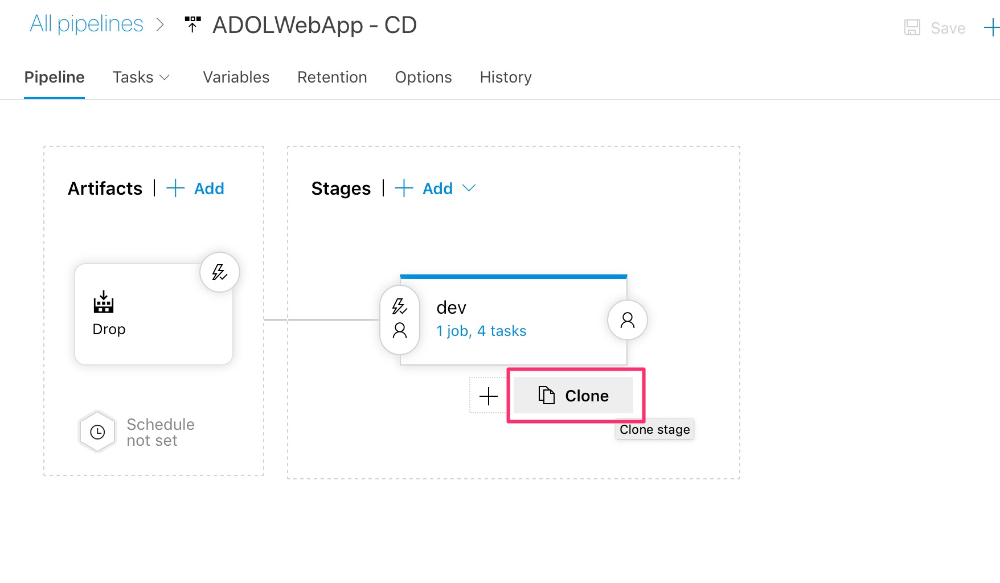

Click on the Copy of Dev title, rename the stage to QA and close the window:

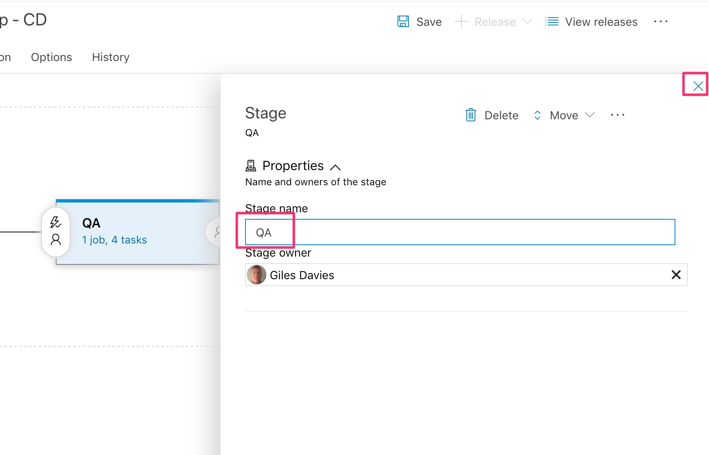

Click on the 1 job, 4 tasks link in the newly created QA stage:

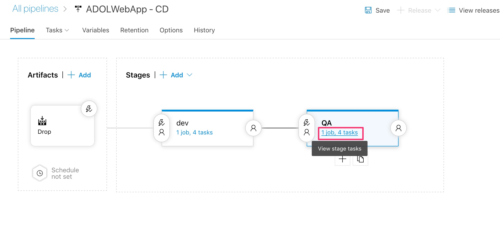

Edit the provisioning task to create a new QA resource group and a web app with a different name - append "QA" to both strings:

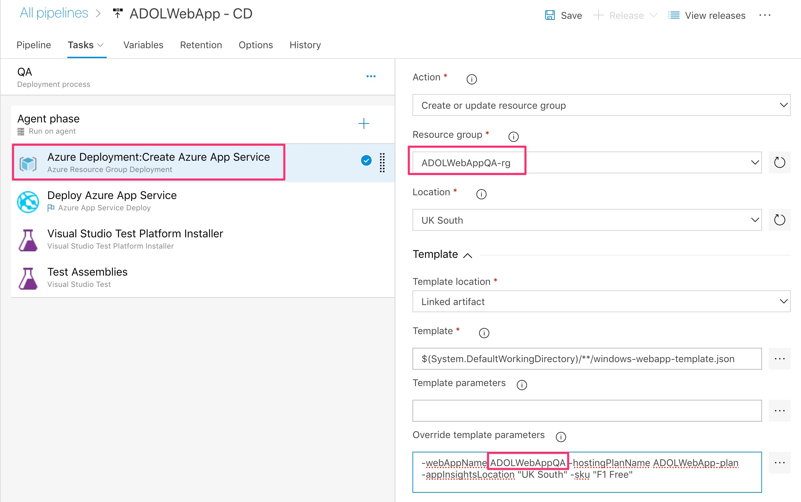

Edit the deployment task to reference the same name as set in the provisioning step above:

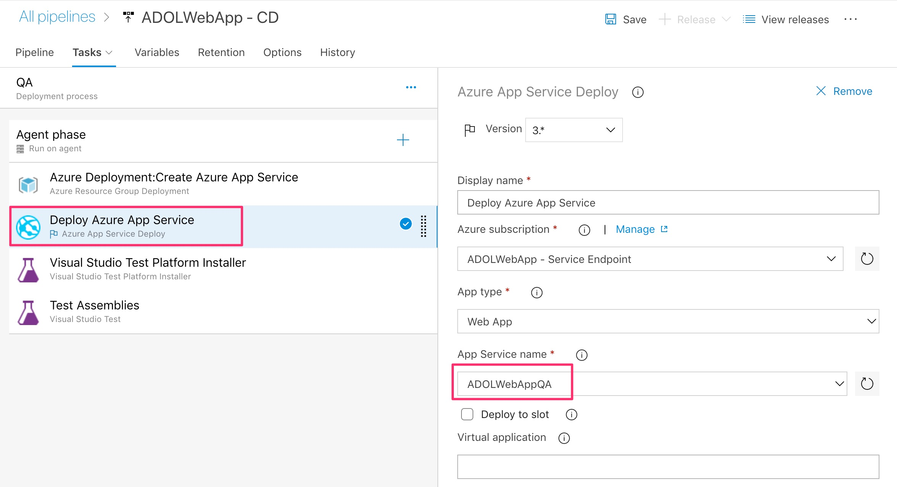

Save the changes to the QA tasks:

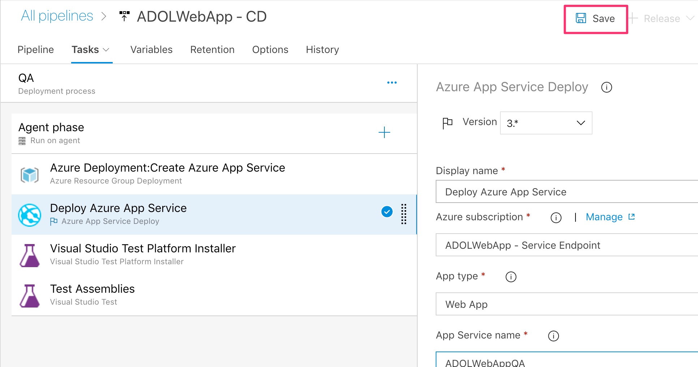

# Step 2: Add a pre-deployment approval to the QA environment

Select the pipeline view:

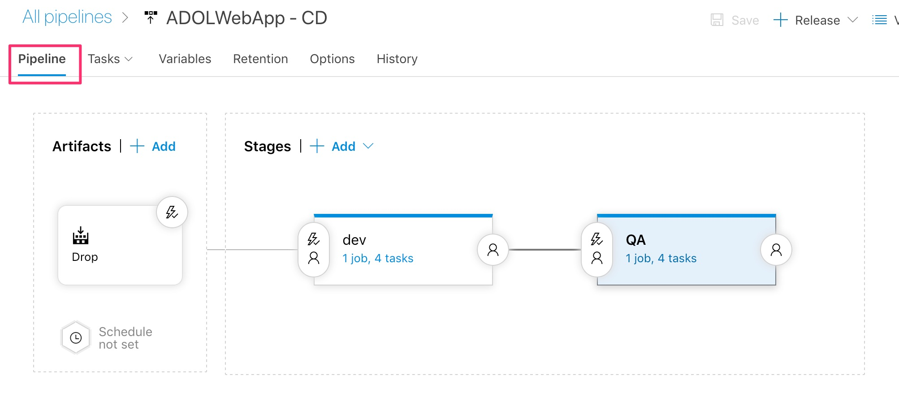

Click on the pre-deployment conditions area of the QA environment:

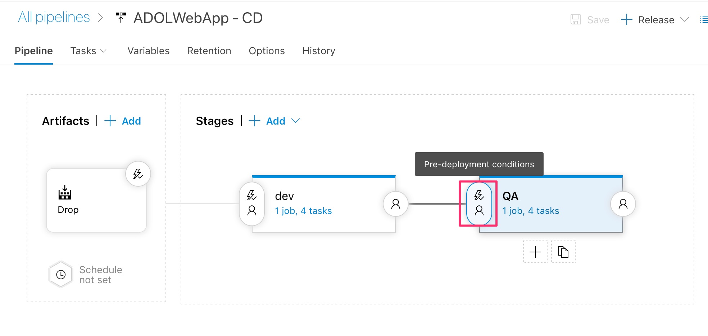

Make the following changes:

- Toggle the Enable pre-deployment approvals switch so that approvals are required.
- Add at least one user or group. There will be a project group that you are already a member of with the same name as the project, add this, and also your own identity.
- Set the approval order to Any one user.
- Ensure that "The user requesting a release or deployment should not approve it" check box is clear. This is a good setting in practice but for the lab it would prevent you from approving your own releases.
- Close the settings by clicking on the cross.

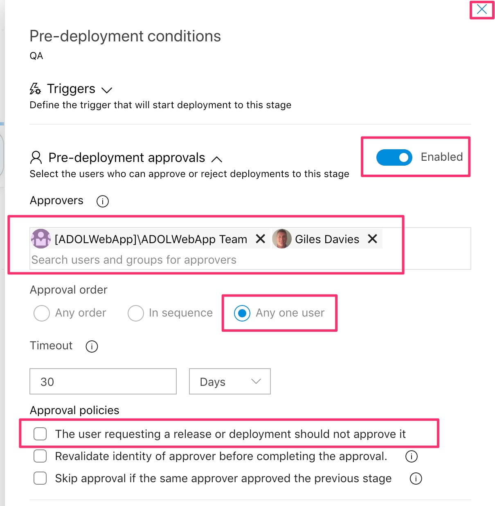

Save the changes and create a release manually to test the changes:

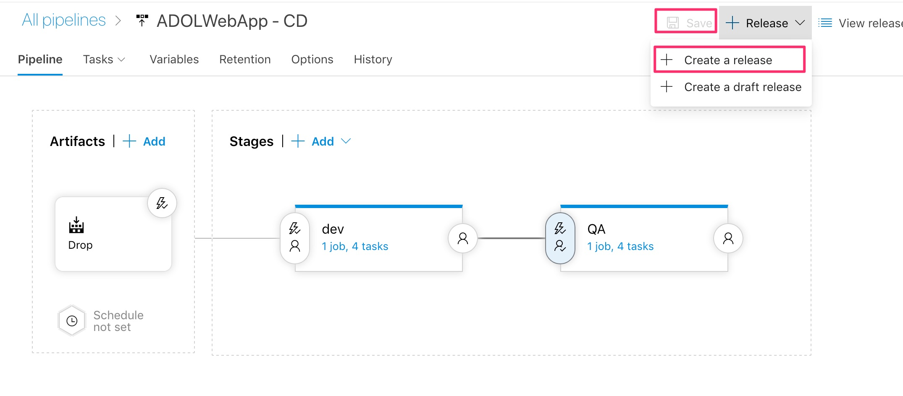

Keep the defaults (although note the options to limit the stages deployed to and to select the artifact versions) and clicj Create:

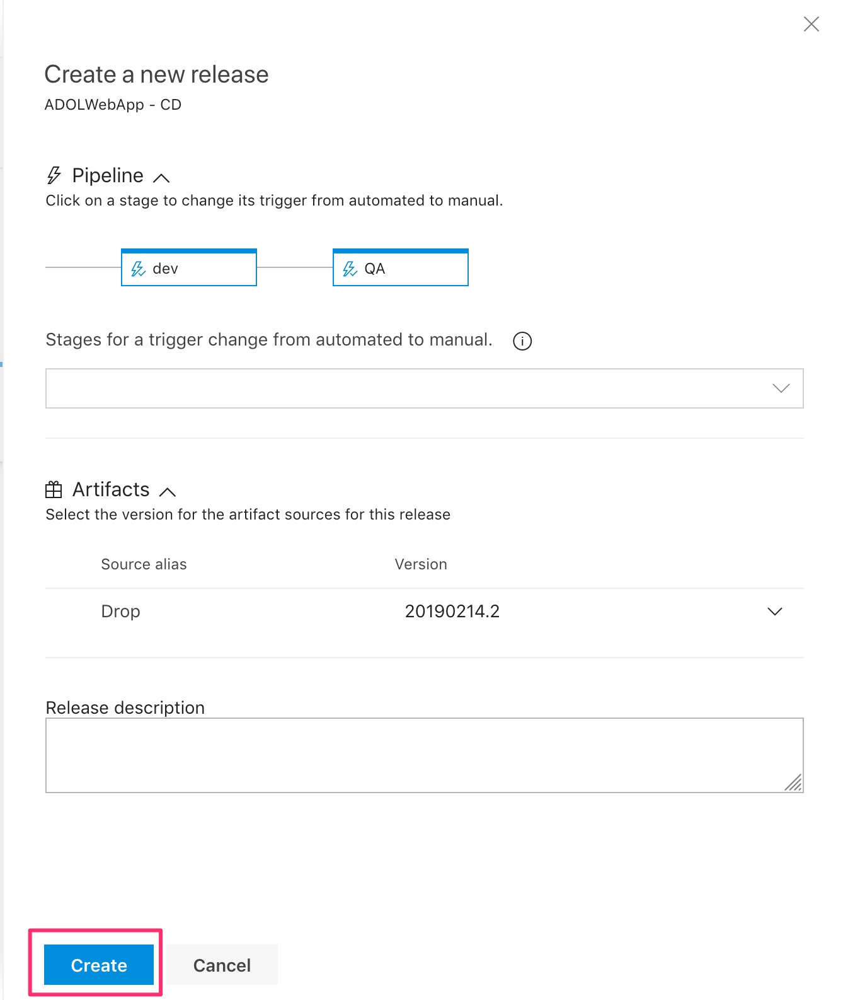

Click on the release link to watch the release:

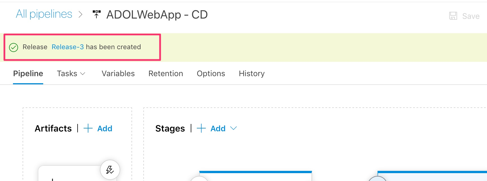

Wait until the dev stage is complete and then notice that an approval is pending for the QA stage. The approvers will receive an email notification and can also be notified via other tools such as Teams or Slack. Click on the pending approval link in the QA stage:

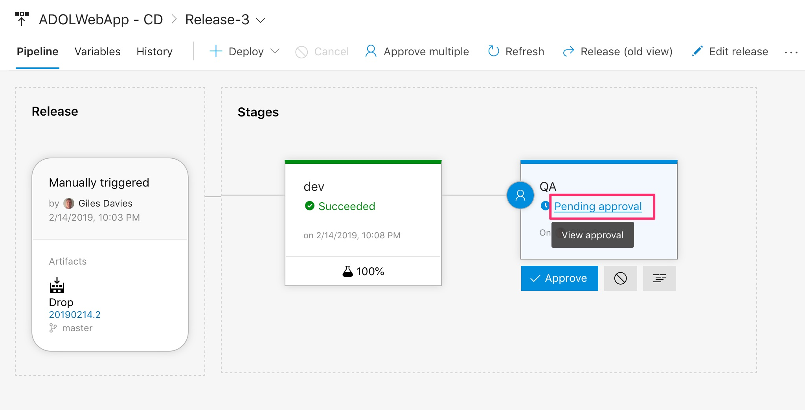

Note that any one of the two approvers (a group and a person) can complete the approval. The options are to reject the release, approve it for immediate deployment or defer and pick a date and time for deployment. Optionally add a comment (e.g. "Approved for QA"  and click Approve to allow the creation of the QA environment:

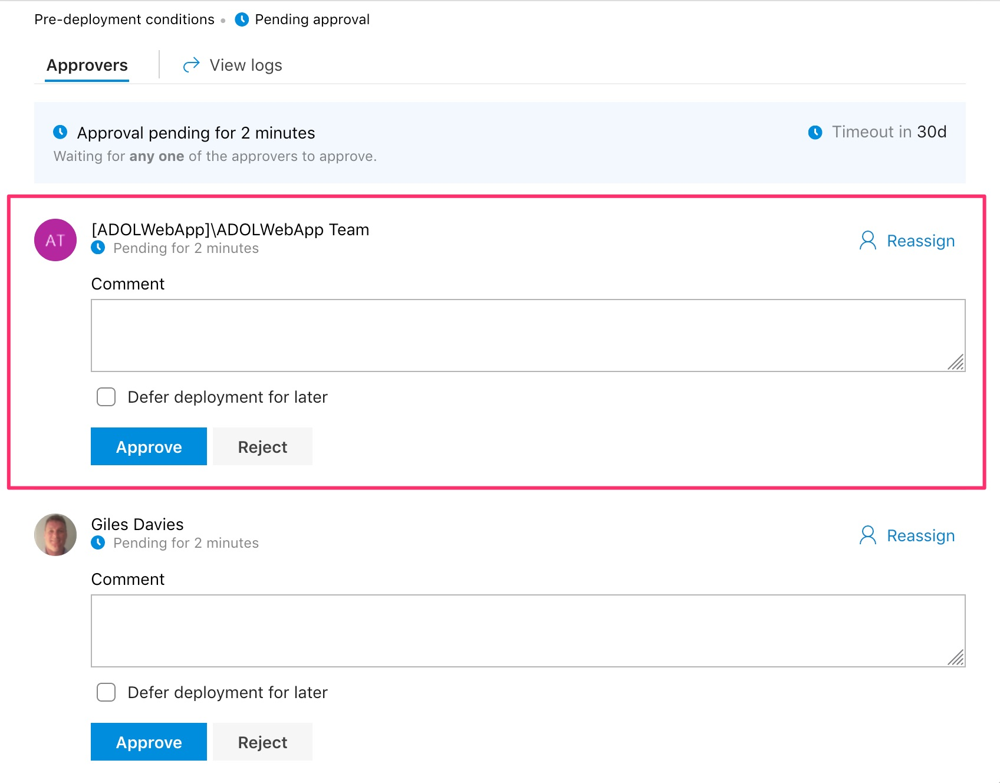

[<- Lab 5: Deploy changes via a Pull Request](https://github.com/gidavies/AzureDevOpsLab/blob/master/AzureDevOpsLab5.md) | [Lab 7: Improve the continuous integration ->](https://github.com/gidavies/AzureDevOpsLab/blob/master/AzureDevOpsLab7.md)
