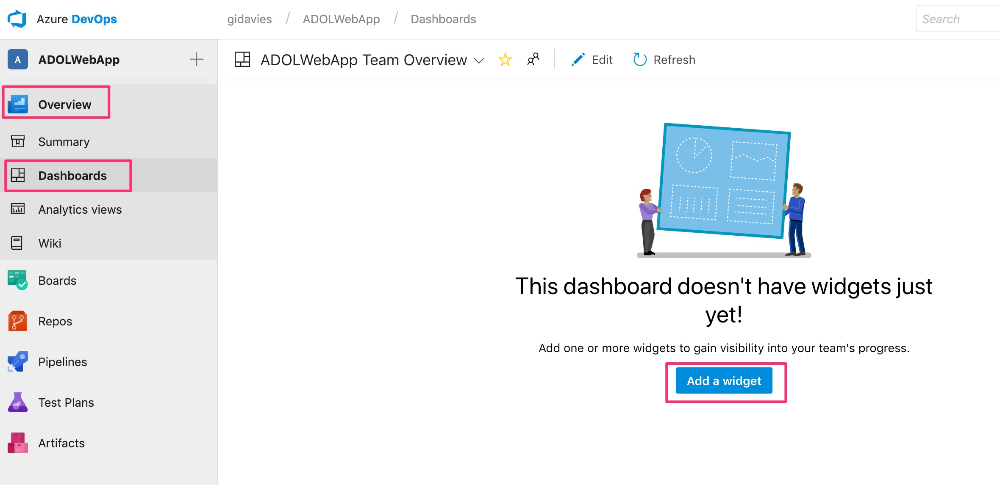
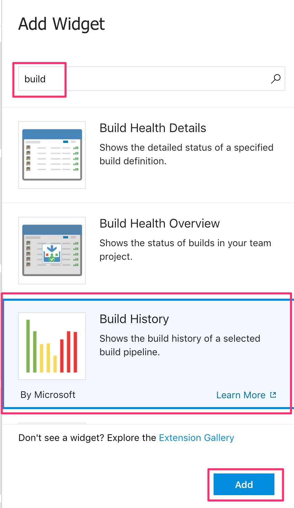
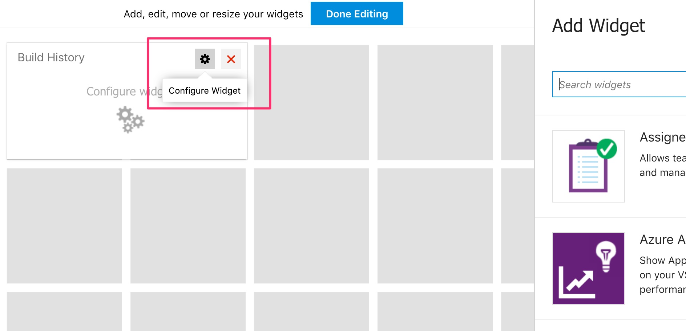
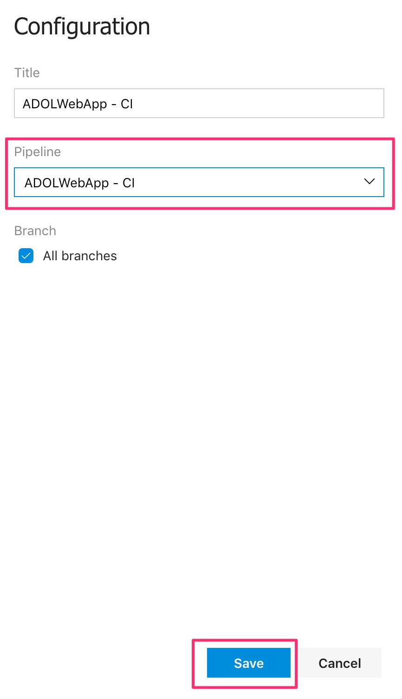
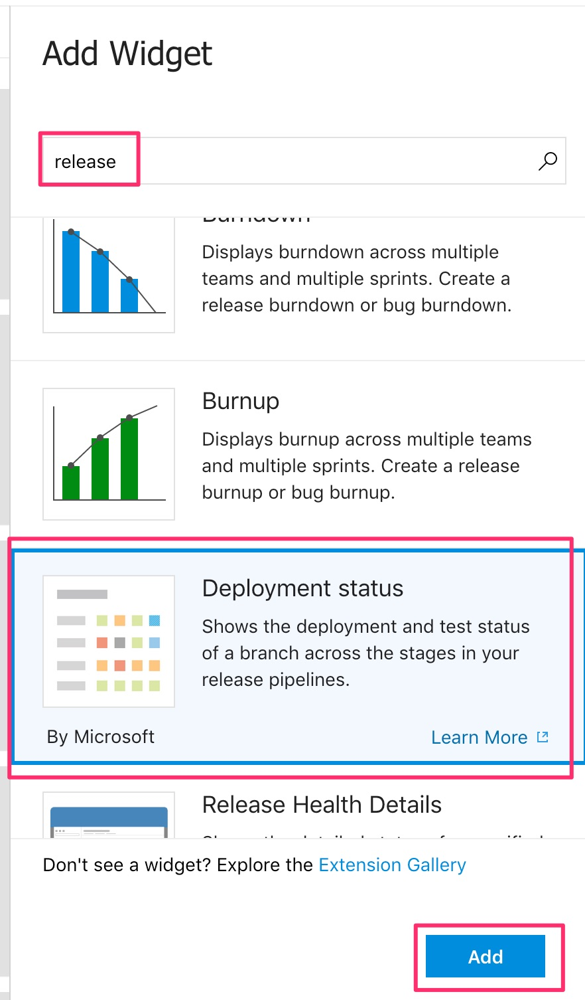
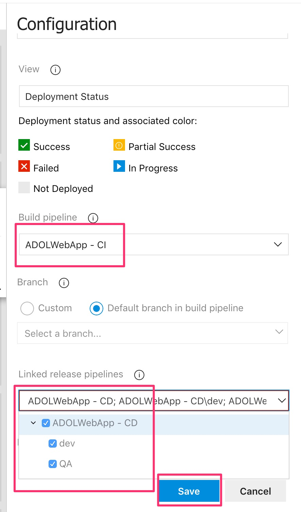
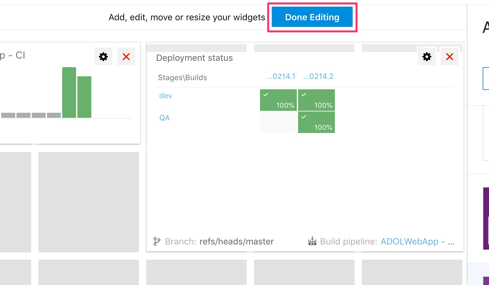
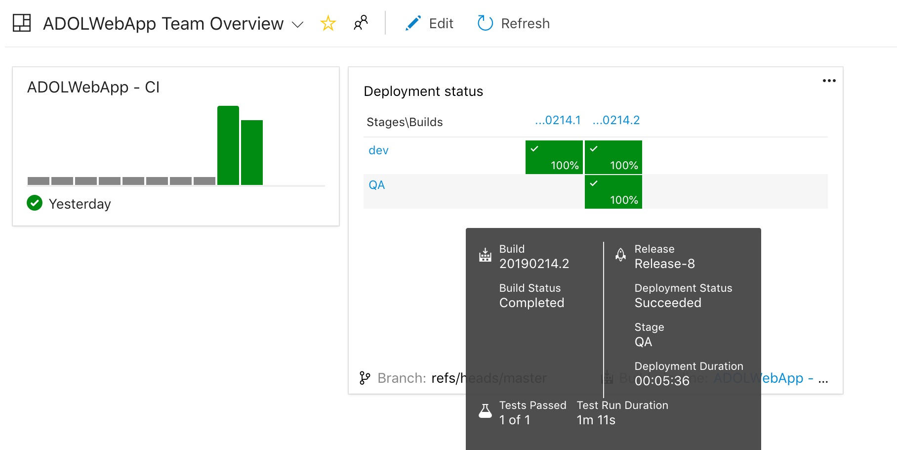
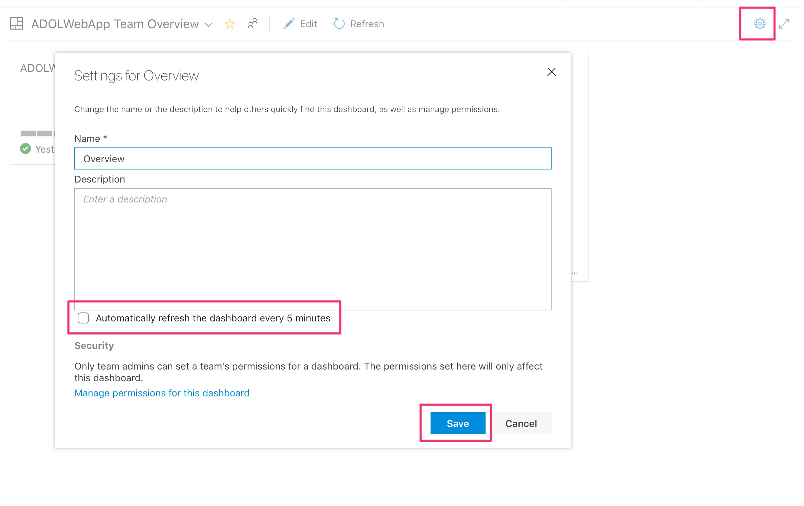

# Lab 7: Create a release dashboard

In this lab we will create an Azure Boards dashboard to show build and release status.

# Adding widgets to a dashboard

Navigate to the dashboards (Overview | Dashboards) and click on Add a widget:

Type in "build" and select the Build History widget, and then click Add:

In the newly added widget select the settings cog:

Set the build pipeline to the one used in this project and click Save:

Add another widget by typing in "release" and then select and add the Deployment Status widget:

Configure the Deployment Status widget to select the Build pipeline and then select all stages (dev and QA) for the release pipeline, then click Save (you may need to change the widget size to 3x2 if there isn't room in the default size):

Click Done Editing and the dashboard is ready:

If you select the settings for the dashboard (cog in top right hand corner) you can see options to rename the dashboard, auto-refresh the widgets and set security permissions, if desired:

You now have a dashboard showing the current status of build and release pipelines.

[<- Lab 6: Extend the release pipeline](https://github.com/gidavies/AzureDevOpsLab/blob/master/AzureDevOpsLab5.md)
